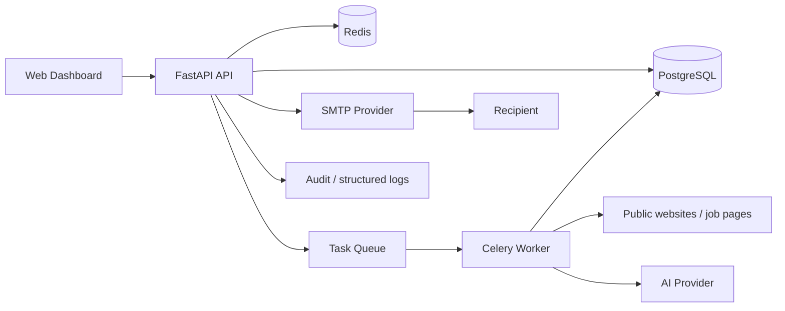

# Техническое задание: AI Outreach System

**Статус документа:** рабочая версия для начала проектирования и разработки  
**Версия:** 1.0  
**Язык интерфейса MVP:** русский с готовностью к локализации  
**Тип продукта:** персональный web-инструмент для поиска работы и portfolio-проект по AI Automation

---

## 1. Назначение проекта

AI Outreach System — платформа для управляемого персонализированного поиска компаний и профессиональной коммуникации с ними.

Система должна:

- находить релевантные компании из разрешённых публичных источников;
- собирать и сохранять подтверждающие источники;
- анализировать компанию, сайт, вакансии и доступные публичные контакты;
- оценивать релевантность компании профилю кандидата;
- генерировать два персонализированных варианта первого письма;
- исключать неподтверждённые факты о кандидате и компании;
- автоматически выбирать язык коммуникации;
- передавать каждое исходящее письмо на ручное подтверждение;
- отправлять только явно одобренные письма;
- предлагать, но не отправлять автоматически follow-up;
- хранить полную историю взаимодействий;
- показывать воронку и ключевые метрики.

Проект не является системой массовой рассылки, спам-инструментом или автономным агентом, который общается без контроля пользователя.

---

## 2. Цели и критерии успеха

### 2.1. Продуктовые цели

1. Сократить время от обнаружения компании до готового персонализированного письма.
2. Повысить качество первого контакта за счёт анализа компании и доказуемой персонализации.
3. Обеспечить полный контроль пользователя над исходящей коммуникацией.
4. Сделать процесс поиска работы измеримым и воспроизводимым.
5. Продемонстрировать в GitHub навыки архитектуры, Python/FastAPI, AI-интеграций, фоновых задач, тестирования, observability и безопасной автоматизации.

### 2.2. Измеримые критерии MVP

- компания может быть добавлена вручную или через discovery-задачу;
- анализ компании содержит ссылки на использованные источники;
- релевантность рассчитывается по объяснимым факторам;
- для компании создаются варианты `Professional` и `Friendly`;
- каждое утверждение о кандидате берётся из подтверждённого профиля;
- письмо нельзя отправить без явного действия `Approve`;
- повторная отправка одного approval невозможна;
- follow-up не создаётся для контакта, который ответил, отказался или находится в suppression list;
- все изменения статусов и отправки отражаются в audit log;
- Dashboard отображает актуальные показатели воронки.

---

## 3. Границы системы

### 3.1. Входит в MVP

- аутентификация одного владельца системы;
- единый профиль кандидата;
- CRUD компаний, контактов и кампаний;
- ручное добавление компании и подключаемый discovery-пайплайн;
- анализ официального сайта и страниц вакансий;
- сохранение источников и извлечённых фактов;
- оценка релевантности;
- автоматическое определение языка с объяснением решения;
- генерация двух вариантов первого письма;
- Review Center;
- отправка через SMTP после подтверждения;
- предложение follow-up;
- ручная регистрация ответа и результата;
- история коммуникаций;
- Dashboard и аналитика;
- настройки, логи, audit trail;
- Docker Compose для локального и демонстрационного запуска;
- REST API и web-интерфейс.

### 3.2. После MVP

- OAuth-подключение Gmail/Outlook и автоматическая синхронизация ответов;
- несколько пользователей и организации;
- браузерное расширение;
- дополнительные discovery-провайдеры;
- календарь интервью;
- A/B-аналитика формулировок;
- webhook/API для внешних automation-платформ;
- облачное объектное хранилище;
- полнотекстовый и семантический поиск.

### 3.3. Не входит

- массовая рассылка;
- автоматическая отправка первого письма;
- автоматическая отправка follow-up;
- обход CAPTCHA, paywall, robots.txt или ограничений источника;
- получение закрытых либо купленных без законного основания персональных данных;
- угадывание email-адресов без маркировки и проверки;
- отправка на непроверенные адреса;
- автономные ответы от имени кандидата;
- создание ложного опыта, достижений или навыков.

---

## 4. Основные архитектурные решения

### 4.1. Архитектурный стиль

На старте используется **модульный монолит** с отдельным worker-процессом:

- проще разрабатывать, тестировать и демонстрировать, чем набор микросервисов;
- транзакции и бизнес-правила остаются в одном приложении;
- модули имеют чёткие границы и могут быть вынесены в сервисы при росте нагрузки;
- web API и фоновые задания масштабируются независимо.

### 4.2. Рекомендуемый стек

**Backend**

- Python;
- FastAPI;
- Pydantic Settings для конфигурации;
- SQLAlchemy 2.x;
- Alembic;
- PostgreSQL;
- Redis;
- Celery как очередь фоновых заданий;
- HTTPX для внешних HTTP-запросов;
- BeautifulSoup/lxml для ограниченного извлечения данных из HTML;
- абстракции провайдеров AI и SMTP.

**Web UI**

- React + TypeScript;
- Vite;
- компонентная библиотека с доступными базовыми компонентами;
- TanStack Query для серверного состояния;
- React Hook Form и schema-валидация.

Для самого быстрого прототипа допустим FastAPI + Jinja2 + HTMX, но целевой GitHub-проект рекомендуется строить с отдельным TypeScript frontend: это лучше разделяет API и UI и позволяет развивать продукт без переписывания backend.

**Инфраструктура**

- Docker и Docker Compose;
- Nginx или Traefik как reverse proxy в production;
- структурированные JSON-логи;
- OpenTelemetry-ready трассировка;
- Sentry-совместимый сбор ошибок;
- GitHub Actions.

### 4.3. Логическая схема



SMTP вызывается только из синхронного контролируемого application service после проверки действительного approval. Discovery, анализ и генерация выполняются worker-процессом.

### 4.4. Модули backend

- `auth` — вход, сессии, роли и защита web/API;
- `candidate_profile` — профиль, навыки, опыт, проекты и правила;
- `companies` — компании, домены, статусы;
- `contacts` — публичные контакты и подтверждение источников;
- `discovery` — источники, поиск и импорт;
- `research` — загрузка страниц, извлечение и нормализация фактов;
- `relevance` — scoring и объяснение оценки;
- `campaigns` — группировка компаний и настройки кампании;
- `generation` — prompts, AI providers, варианты писем и проверки;
- `review` — review queue и переходы состояний;
- `delivery` — SMTP, idempotency и журнал доставки;
- `followups` — правила предложений follow-up;
- `communications` — сообщения, ответы, события и timeline;
- `analytics` — агрегаты и воронка;
- `settings` — настройки и секреты;
- `audit` — неизменяемый журнал действий;
- `shared` — общие типы, исключения и инфраструктурные адаптеры.

### 4.5. Рекомендуемая структура репозитория

```text
ai-outreach-system/
├── .github/
│   ├── workflows/
│   └── ISSUE_TEMPLATE/
├── apps/
│   ├── api/
│   │   ├── src/ai_outreach/
│   │   │   ├── api/
│   │   │   ├── modules/
│   │   │   ├── infrastructure/
│   │   │   ├── workers/
│   │   │   └── main.py
│   │   ├── migrations/
│   │   └── tests/
│   └── web/
│       ├── src/
│       └── tests/
├── docs/
│   ├── architecture/
│   ├── adr/
│   ├── api/
│   └── screenshots/
├── infra/
│   ├── docker/
│   └── nginx/
├── scripts/
├── .env.example
├── compose.yaml
├── Makefile
├── pyproject.toml
├── README.md
├── CONTRIBUTING.md
├── SECURITY.md
└── LICENSE
```

---

## 5. Архитектура хранения данных

### 5.1. Сравнение вариантов

| Вариант | Преимущества | Ограничения | Роль в проекте |
|---|---|---|---|
| Google Sheets | знакомый интерфейс, быстрый ручной обзор, простой экспорт | слабые связи и транзакции, проблемы конкурентного доступа, аудит и секреты, ограниченная масштабируемость | только экспорт/импорт и отчёты |
| SQLite | нулевая инфраструктура, удобно для тестов и локального demo | один файл, ограниченная конкурентная запись, неудобен для нескольких процессов | локальные тесты и упрощённый demo |
| PostgreSQL | транзакции, связи, JSONB, индексы, миграции, конкурентность, надёжность | нужен отдельный сервис и резервное копирование | основная production БД |
| Комбинированный | сильные стороны каждого инструмента | требуется явное определение источника истины | рекомендуемый подход |

### 5.2. Решение

**PostgreSQL — единственный источник истины.**

Дополнительно:

- Redis — очередь, краткоживущий cache, locks и rate limiting, но не постоянные бизнес-данные;
- SQLite — только unit/integration-тесты, если тест не зависит от PostgreSQL-специфичного поведения; ключевые интеграционные тесты выполняются на PostgreSQL;
- Google Sheets — односторонний экспорт выбранных представлений или контролируемый импорт, но не двусторонняя синхронизация в MVP;
- файловое/объектное хранилище — снимки страниц и вложения только при необходимости и с политикой хранения.

Такой вариант даёт production-надёжность и сохраняет удобство Sheets без конфликтов двух источников истины.

---

## 6. Модель данных

Все основные таблицы имеют UUID, `created_at`, `updated_at`. Пользовательские изменения должны содержать `created_by`/`updated_by`, где это применимо.

### 6.1. Основные сущности

**User**

- идентификатор;
- email;
- password hash или внешний identity;
- роль;
- timezone;
- статус.

**CandidateProfile**

- имя и профессиональный заголовок;
- location;
- summary;
- уровень английского с типом подтверждения;
- желаемые роли;
- предпочтительные страны и форматы работы;
- salary expectations — опционально и приватно;
- GitHub, LinkedIn, Telegram, Facebook, Email;
- состояние профиля: draft/verified;
- версия профиля.

**CandidateExperience**

- компания;
- роль;
- даты;
- описание;
- подтверждённые достижения;
- разрешение использовать факт в письмах.

**CandidateProject**

- название;
- описание;
- ссылки;
- технологии;
- подтверждённые результаты;
- разрешение использовать факт в письмах.

**CandidateSkill**

- навык/технология;
- уровень в нейтральной шкале;
- источник подтверждения;
- разрешение использовать в письмах.

**CandidateRule**

- тип правила;
- текст;
- severity: warning/block;
- active;
- приоритет.

**Company**

- название;
- основной домен;
- страна;
- отрасль;
- размер — если подтверждён;
- описание;
- language signals;
- текущий pipeline status;
- relevance score;
- relevance explanation;
- дата последнего анализа.

**CompanySource**

- URL;
- source type;
- время получения;
- HTTP status;
- content hash;
- extracted text;
- language;
- trust level;
- срок актуальности;
- ошибка загрузки.

**CompanyFact**

- тип факта;
- значение;
- confidence;
- source id;
- точный фрагмент/locator;
- статус: extracted/verified/rejected/stale.

**JobOpening**

- title;
- URL;
- location;
- description;
- required skills;
- дата публикации/обнаружения;
- active status;
- source id.

**Contact**

- имя;
- роль;
- company id;
- email и статус проверки;
- LinkedIn или другая публичная ссылка;
- предполагаемый язык;
- source id;
- lawful/public-source note;
- статус do-not-contact;
- confidence.

**Campaign**

- название;
- цель;
- критерии компании;
- предпочтительный язык;
- tone defaults;
- лимиты;
- статус.

**EmailDraft**

- company/contact/campaign;
- тип: first/follow_up;
- вариант: professional/friendly/custom;
- subject/body;
- language;
- prompt version;
- model/provider;
- candidate profile version;
- входные source ids;
- validation report;
- статус;
- номер ревизии.

**Approval**

- email draft revision;
- decision: approved/deferred/rejected;
- user id;
- timestamp;
- comment;
- одноразовый approval token/version.

**Message**

- direction: outbound/inbound;
- channel;
- subject/body;
- delivery status;
- external message id;
- sent/received time;
- related draft and contact.

**FollowUpProposal**

- related outbound message;
- due time;
- generated draft;
- статус;
- причина отмены.

**CommunicationEvent**

- company/contact;
- тип: discovered/analyzed/draft_created/approved/sent/replied/interview/rejected/offer/closed/note;
- timestamp;
- metadata;
- user comment.

**SuppressionEntry**

- email/domain/contact;
- причина;
- дата;
- источник;
- active.

**AuditEvent**

- actor;
- action;
- entity type/id;
- before/after или diff без секретов;
- request/correlation id;
- timestamp;
- IP/user agent при необходимости.

**AppSetting / SecretReference**

- namespace/key;
- безопасное значение или ссылка на secret provider;
- флаг секрета;
- дата ротации.

### 6.2. Ключевые ограничения

- уникальность нормализованного домена компании;
- уникальность нормализованного email в рамках компании;
- письмо с `sent` не редактируется;
- approval относится к конкретной неизменяемой ревизии draft;
- отправить можно только `approved` ревизию;
- один idempotency key соответствует не более чем одной отправке;
- удаление компании не должно физически уничтожать audit history;
- секреты, полный HTML и персональные данные не попадают в application logs.

---

## 7. Состояния и workflow

### 7.1. Company pipeline

```text
NEW
→ DISCOVERED
→ RESEARCH_PENDING
→ RESEARCHED
→ QUALIFIED | NOT_RELEVANT | NEEDS_REVIEW
→ CONTACT_FOUND | CONTACT_MISSING
→ DRAFT_READY
→ OUTREACH_ACTIVE
→ REPLIED | INTERVIEW | REJECTED | OFFER | CLOSED
```

### 7.2. Draft lifecycle

```text
DRAFT
→ VALIDATING
→ BLOCKED | READY_FOR_REVIEW
→ APPROVED | DEFERRED | REJECTED
→ SENDING
→ SENT | DELIVERY_FAILED
```

При редактировании `READY_FOR_REVIEW` или `APPROVED` создаётся новая ревизия. Старое approval становится недействительным.

### 7.3. Follow-up lifecycle

```text
SCHEDULED
→ DUE
→ DRAFT_READY
→ APPROVED | DEFERRED | REJECTED | CANCELLED
→ SENT | DELIVERY_FAILED
```

Поступление ответа, статус do-not-contact, завершение кампании или ручное закрытие автоматически отменяют ожидающие follow-up.

---

## 8. Candidate Profile Engine

### 8.1. Требования

- профиль редактируется в структурированной форме;
- опыт, проекты и навыки хранятся отдельными проверяемыми фактами;
- каждый факт имеет признак, разрешено ли использовать его в исходящих письмах;
- система хранит версии профиля;
- генерация привязана к конкретной версии;
- перед активацией профиля выполняется проверка полноты;
- пользователь видит, какие данные использованы в каждом письме.

### 8.2. Обязательные правила

Система блокирует письмо, если оно:

- придумывает опыт;
- завышает уровень английского;
- содержит ложное или неподтверждённое достижение;
- использует `Senior` или `Expert`, если это явно не разрешено профилем;
- добавляет технологию, отсутствующую в подтверждённых навыках;
- выдаёт AI-предположение за факт;
- содержит личные контакты, не разрешённые кандидатом.

### 8.3. Техническая реализация guardrails

1. LLM получает только разрешённый `candidate_fact_pack`, а не свободный полный текст.
2. Результат генерации возвращается в структурированном JSON.
3. Модель обязана перечислить `candidate_fact_ids` и `company_fact_ids`, использованные в письме.
4. Детерминированный validator проверяет ссылки на факты, запрещённые слова и настройки профиля.
5. Отдельная AI-проверка может искать неподтверждённые утверждения, но не заменяет детерминированный validator.
6. Любое нарушение severity `block` переводит draft в `BLOCKED`.
7. UI показывает validation report и источники рядом с текстом.

---

## 9. Company Discovery и Research

### 9.1. Источники

Источники подключаются через интерфейс `DiscoveryProvider`:

- ручное добавление URL;
- официальный сайт компании;
- официальная careers/jobs page;
- разрешённые поисковые API;
- публичные каталоги с разрешённым использованием;
- CSV-импорт.

Для каждого провайдера документируются ToS, rate limits, способ атрибуции и политика хранения.

### 9.2. Пайплайн

1. Получить URL/результат провайдера.
2. Нормализовать домен и проверить дубликат.
3. Проверить URL на SSRF и разрешённость схемы.
4. Соблюсти robots.txt, rate limit и timeout.
5. Загрузить ограниченный объём публичного контента.
6. Определить язык страницы.
7. Извлечь факты, вакансии и сигналы релевантности.
8. Сохранить source, timestamp, content hash и provenance.
9. Рассчитать relevance score.
10. Передать спорные результаты на ручную проверку.

### 9.3. Поиск контакта

Приоритет:

1. официальный публичный контакт на сайте;
2. Founder/CEO/CTO/Head of Engineering/Recruiter в зависимости от размера и цели;
3. контакт из официальной вакансии;
4. общий careers email, если персонального подтверждённого контакта нет.

Найденный адрес должен иметь source URL и статус:

- `verified_public`;
- `provider_verified`;
- `unverified`;
- `invalid`;
- `suppressed`.

На `unverified`, `invalid` и `suppressed` отправка запрещена.

### 9.4. Relevance scoring

Начальная шкала: 0–100.

| Фактор | Вес |
|---|---:|
| совпадение желаемой роли | 25 |
| совпадение технологий и задач | 20 |
| наличие активной вакансии | 20 |
| страна/remote preference | 15 |
| соответствие проектов кандидата деятельности компании | 10 |
| доступность релевантного контакта | 5 |
| свежесть и надёжность источников | 5 |

Пороговые значения настраиваются:

- `70–100` — qualified;
- `45–69` — needs review;
- `<45` — not relevant.

Система хранит не только число, но и breakdown, причины и использованные факты. LLM может объяснять оценку, но итоговая формула должна быть воспроизводимой.

---

## 10. Communication Strategy и определение языка

### 10.1. Сигналы

- языки официального сайта;
- язык страницы контакта или вакансии;
- страна компании;
- публично подтверждённый язык контактного лица;
- настройка кампании;
- ручное переопределение.

### 10.2. Приоритет правил

1. Ручное решение пользователя.
2. Подтверждённый предпочтительный язык конкретного контакта.
3. Если Founder/контакт публично ведёт профессиональную коммуникацию на русском — русский.
4. Если сайт имеет полноценную русскую версию — русский.
5. Если сайт и вакансия только на английском — английский.
6. При неоднозначности — английский и флаг `language_needs_review`.

Решение хранится с confidence, набором сигналов и объяснением. Национальность или имя не используются как доказательство языка.

---

## 11. Outreach Engine

### 11.1. Вход генерации

- выбранный контакт и его роль;
- подтверждённые company facts с источниками;
- релевантная вакансия;
- разрешённые candidate facts;
- правила кандидата;
- язык;
- цель кампании;
- ограничения длины и tone;
- версия prompt.

### 11.2. Результат

Для первого контакта создаются:

- **Variant A — Professional**: сдержанный, конкретный, профессиональный;
- **Variant B — Friendly**: более тёплый, естественный, но без фамильярности.

Каждый вариант включает:

- subject;
- plain-text body;
- опциональный безопасный HTML preview;
- язык;
- короткое объяснение персонализации;
- список использованных фактов и источников;
- validation report;
- предупреждения;
- оценку длины.

### 11.3. Требования к письму

- одно понятное основание обращения;
- конкретная связь между компанией и релевантным опытом/проектом;
- честный и короткий call to action;
- отсутствие шаблонной лести;
- отсутствие неподтверждённых предположений;
- отсутствие скрытых tracking pixels в MVP;
- plain-text версия обязательна;
- подпись строится только из разрешённых контактов;
- лимит длины настраивается, рекомендуемый default — 80–160 слов.

### 11.4. AI Provider abstraction

Интерфейс должен позволять менять провайдера без изменения доменной логики:

- `generate_structured()`;
- `validate_claims()`;
- `healthcheck()`;
- `estimate_cost()`.

Хранятся model name, provider, latency, token usage, estimated cost и prompt version. API-ключи и полный системный prompt не попадают в логи.

---

## 12. Review Center

### 12.1. Очередь

Карточка review содержит:

- компанию и контакт;
- relevance score и причины;
- язык и объяснение выбора;
- варианты A/B;
- подсветку использованных фактов;
- ссылки на источники;
- validation warnings;
- историю ревизий;
- будущий follow-up plan.

### 12.2. Действия пользователя

- `Edit` — создать новую ревизию;
- `Approve` — утвердить конкретную ревизию;
- `Send now` — отправить утверждённую ревизию;
- `Approve and send` — атомарно утвердить и инициировать одну отправку;
- `Defer` — отложить с датой;
- `Reject` — отклонить с причиной;
- `Regenerate A/B` — создать новые ревизии;
- `Mark do not contact`.

### 12.3. Защита отправки

Перед SMTP-вызовом backend повторно проверяет:

- пользователь авторизован;
- draft не изменён после approval;
- contact подтверждён;
- suppression отсутствует;
- rate limit не превышен;
- кампания активна;
- письмо ещё не отправлялось;
- idempotency key уникален;
- обязательные validators пройдены.

Отправка должна использовать transactional outbox или эквивалентный механизм, чтобы сбой процесса не создавал неизвестное состояние или дубль.

---

## 13. Follow-up

### 13.1. Правила

- расписание задаётся на уровне системы и кампании;
- учитывается timezone пользователя;
- follow-up создаётся только после успешной отправки;
- до генерации проверяется наличие ответа;
- proposal также требует ручного approval;
- при ответе, отказе, интервью, закрытии или suppression предложение отменяется;
- максимальное число follow-up настраивается, default MVP — 1;
- минимальный интервал настраивается, default — 5 рабочих дней.

### 13.2. Содержание

Follow-up:

- короче первого письма;
- ссылается на предыдущее сообщение;
- не создаёт давление;
- не добавляет новые неподтверждённые факты;
- имеет собственный validation report.

---

## 14. Communication History

Timeline компании должен объединять:

- дату и источник обнаружения;
- результаты анализа;
- изменения relevance;
- найденные контакты;
- созданные версии писем;
- решения review;
- отправки и ошибки доставки;
- follow-up;
- входящие ответы;
- интервью;
- итоговый статус;
- пользовательские заметки;
- системные audit-события, доступные по отдельному фильтру.

В MVP ответы можно регистрировать вручную. После подключения почтового OAuth ответы связываются по `Message-ID`, `In-Reply-To` и thread id; сопоставление только по теме письма недостаточно.

---

## 15. Web Dashboard

### 15.1. Dashboard

- карточки KPI;
- воронка;
- review queue;
- follow-up due;
- recent activity;
- ошибки интеграций;
- компании, требующие решения.

### 15.2. Companies

- таблица, поиск, фильтры, сортировка;
- pipeline status;
- relevance score;
- язык;
- наличие вакансии и контакта;
- bulk-действия только для анализа/тегов, не для отправки;
- detail page с facts, sources, jobs и timeline.

### 15.3. Contacts

- компания, роль, канал;
- verification status;
- source;
- language;
- do-not-contact;
- история сообщений.

### 15.4. Campaigns

- цель и критерии;
- компании;
- tone/язык;
- лимиты;
- follow-up policy;
- статистика.

### 15.5. Generated Emails / Review Center

- очередь draft;
- side-by-side A/B;
- редактор;
- source inspector;
- validation panel;
- approve/defer/reject/send.

### 15.6. Follow-ups

- upcoming, due, cancelled, sent;
- причина;
- редактор и review;
- изменение даты.

### 15.7. Candidate Profile

- данные, опыт, проекты, навыки;
- ссылки и контакты;
- предпочтения;
- rules;
- верификация;
- preview разрешённого fact pack.

### 15.8. Communication History

- глобальный timeline;
- фильтры по компании, контакту, кампании, событию и дате;
- ручная регистрация ответа/интервью/результата.

### 15.9. Settings

- AI provider/model;
- SMTP;
- лимиты;
- follow-up schedule;
- шаблоны и prompt versions;
- контакты кандидата;
- API keys;
- retention;
- timezone;
- тесты соединения без раскрытия секрета.

### 15.10. Logs

Разделить:

- понятные пользователю job/activity logs;
- технические application logs;
- security/audit events.

UI не показывает секреты и чувствительные payload.

---

## 16. API

API version prefix: `/api/v1`.

Основные группы:

```text
/auth
/candidate-profile
/candidate-facts
/companies
/companies/{id}/sources
/companies/{id}/research
/companies/{id}/relevance
/contacts
/campaigns
/drafts
/drafts/{id}/revisions
/drafts/{id}/validate
/drafts/{id}/approve
/drafts/{id}/defer
/drafts/{id}/reject
/drafts/{id}/send
/followups
/communications
/analytics
/settings
/jobs
/audit
/health/live
/health/ready
```

Требования:

- OpenAPI генерируется FastAPI;
- DTO отделены от ORM-моделей;
- pagination/filter/sort имеют единый формат;
- ошибки используют единый machine-readable schema;
- mutation endpoints поддерживают optimistic locking/version;
- `send` требует `Idempotency-Key`;
- correlation/request id возвращается клиенту;
- чувствительные поля никогда не возвращаются после записи.

---

## 17. Фоновые задачи

Задачи:

- discovery;
- fetch website;
- extract facts;
- find jobs;
- contact research;
- relevance calculation;
- email generation;
- draft validation;
- follow-up scheduling;
- analytics aggregation;
- cleanup/retention.

Требования:

- retry только для временных ошибок;
- exponential backoff + jitter;
- hard/soft timeout;
- dead-letter/failed jobs view;
- уникальность задания по entity + task type + input version;
- heartbeat и статус прогресса;
- отмена задания;
- повторный запуск из UI;
- rate limits по внешнему домену и AI provider;
- trace/correlation id проходит через API, queue и worker.

SMTP-задача не должна автоматически повторяться после неизвестного результата без проверки внешнего message id: это предотвращает дубли.

---

## 18. Конфигурация и секреты

Приоритет:

1. environment variables;
2. secret manager в production;
3. безопасно сохранённые настройки приложения;
4. не секретные defaults.

Обязательные группы:

- `APP_*`;
- `DATABASE_*`;
- `REDIS_*`;
- `AI_*`;
- `SMTP_*`;
- `SECURITY_*`;
- `DISCOVERY_*`;
- `OBSERVABILITY_*`.

В репозитории:

- только `.env.example`;
- реальные `.env`, токены, пароли, production dumps и персональные данные исключены через `.gitignore`;
- secret scanning включён в CI;
- настройки валидируются при старте;
- приложение аварийно завершает startup при небезопасной production-конфигурации.

---

## 19. Безопасность, приватность и compliance

### 19.1. Application security

- password hashing Argon2id;
- secure HTTP-only cookies либо короткоживущие tokens;
- CSRF-защита для cookie-based auth;
- CORS allowlist;
- security headers;
- rate limiting;
- валидация входов;
- запрет приватных и loopback IP при загрузке пользовательских URL;
- ограничение размера ответа, redirect count, content type и времени загрузки;
- HTML очищается перед preview;
- SQL injection предотвращается ORM/parameterized queries;
- зависимости регулярно сканируются.

### 19.2. AI security

Контент сайта считается недоверенным:

- инструкции со страниц не выполняются;
- содержимое источника помещается в явно отделённый data-контекст;
- tool access модели минимален;
- structured output валидируется схемой;
- prompt injection отмечается как риск;
- внешняя страница не может изменить candidate rules или инициировать отправку.

### 19.3. Privacy и outreach policy

- собирать только минимально необходимые публичные профессиональные данные;
- сохранять URL и основание использования;
- поддерживать исправление и удаление данных;
- иметь retention policy;
- поддерживать suppression list;
- прекращать follow-up после отказа;
- учитывать применимые правила страны кандидата, компании и получателя;
- не заявлять юридическую совместимость автоматически — перед реальным использованием провести отдельную юридическую проверку.

---

## 20. Логирование и observability

### 20.1. Логи

Структурированный JSON:

- timestamp;
- level;
- service/process;
- event;
- request/correlation id;
- user id без лишних персональных данных;
- entity ids;
- duration;
- result/error code.

Не логируются:

- API keys;
- SMTP passwords;
- session tokens;
- полные письма по умолчанию;
- полный scraped content;
- пароли;
- приватные контакты без маскирования.

### 20.2. Метрики

- latency и error rate API;
- queue depth;
- длительность и ошибки jobs;
- AI latency/tokens/cost;
- SMTP success/failure;
- число draft по статусам;
- approvals;
- stale sources;
- rate-limit events.

### 20.3. Health checks

- liveness не зависит от внешних сервисов;
- readiness проверяет критичные зависимости;
- подробности ошибок доступны только авторизованному администратору.

---

## 21. Analytics

### 21.1. Метрики

- найдено компаний;
- проанализировано;
- qualified;
- с найденным подтверждённым контактом;
- создано писем;
- одобрено;
- отправлено;
- доставлено/ошибка;
- ответы;
- положительные ответы;
- интервью;
- offers;
- conversion rates по этапам;
- среднее время прохождения этапов;
- статистика по кампаниям, языку и вариантам.

### 21.2. Формулы

- response rate = уникальные компании с ответом / уникальные компании с успешно отправленным первым письмом;
- interview conversion = компании с интервью / компании с успешно отправленным первым письмом;
- approval rate = одобренные draft / рассмотренные draft;
- delivery success = успешные отправки / все попытки отправки.

Показатели считаются по уникальным компаниям там, где повторные сообщения могут исказить результат. Период и timezone отображаются явно.

---

## 22. Тестирование

### 22.1. Уровни

- unit tests доменных правил;
- property-based tests для state transitions и validators;
- integration tests PostgreSQL/Redis/queue;
- provider contract tests;
- API tests;
- frontend component tests;
- end-to-end happy path;
- security tests URL fetcher и permissions;
- migration tests;
- smoke test Docker Compose.

### 22.2. Критичные сценарии

- неподтверждённый навык блокирует draft;
- изменение текста аннулирует approval;
- повторный `send` с тем же idempotency key не отправляет дубль;
- suppression блокирует отправку;
- ответ отменяет follow-up;
- worker retry не создаёт дубликат компании или draft;
- private/internal URL отклоняется;
- prompt injection со страницы не меняет правила;
- секреты маскируются;
- статистика не считает повторное письмо новой компанией.

Минимальные quality gates:

- форматирование и lint;
- type checking;
- тесты;
- migration check;
- dependency/security scan;
- Docker build;
- отсутствие секретов.

---

## 23. CI/CD и GitHub-представление

GitHub Actions:

1. `quality` — formatting, lint, types;
2. `backend-tests` — unit/integration с service containers;
3. `frontend-tests`;
4. `security` — dependencies и secret scan;
5. `build` — Docker images;
6. `e2e`;
7. `release` — только по tag/manual approval.

README должен содержать:

- problem statement;
- architecture diagram;
- screenshots/GIF demo;
- quick start;
- demo data;
- safety principles;
- roadmap;
- tech decisions;
- тесты и CI badge.

Portfolio-репозиторий не должен содержать реальные персональные лиды, ключи, переписку или production database. Для demo используется seed с вымышленными компаниями и контактами.

---

## 24. Docker-окружения

### 24.1. Local Compose

Сервисы:

- `api`;
- `web`;
- `worker`;
- `scheduler`;
- `postgres`;
- `redis`;
- опционально `mailpit` для безопасной тестовой почты.

Профиль `dev` использует hot reload и bind mounts. Профиль `demo` запускается из собранных images и использует seed data.

### 24.2. Production

- non-root containers;
- multi-stage builds;
- pinned dependency lock files;
- read-only filesystem где возможно;
- health checks;
- resource limits;
- отдельные credentials для сервисов;
- TLS на reverse proxy;
- миграции выполняются отдельным release job;
- backup PostgreSQL с проверкой восстановления.

---

## 25. Нефункциональные требования

- API p95 для обычных CRUD-запросов без внешних интеграций: до 500 мс в целевой среде;
- UI не блокируется длительными AI/discovery задачами;
- все длительные операции показывают статус;
- повторное выполнение безопасно;
- система корректно восстанавливается после перезапуска worker;
- accessibility: keyboard navigation, labels, contrast, focus states;
- поддержка последних версий основных desktop-браузеров;
- даты хранятся в UTC, отображаются в timezone пользователя;
- все пользовательские тексты поддерживают Unicode;
- удаление/экспорт данных доступны владельцу;
- RPO/RTO задаются перед production deployment; для персонального MVP рекомендуемый старт: RPO 24 часа, RTO 4 часа.

---

## 26. Этапы разработки

### Этап 0. Architecture baseline

Результаты:

- ADR по modular monolith, storage, queue, frontend и AI provider abstraction;
- threat model;
- ER diagram;
- state machines;
- skeleton репозитория;
- Docker Compose;
- CI quality gates.

### Этап 1. Core Platform

- FastAPI app;
- PostgreSQL/Alembic;
- Redis/Celery;
- auth;
- config;
- logging;
- health checks;
- audit foundation.

### Этап 2. Candidate Profile

- профиль, опыт, проекты, навыки, контакты;
- rules;
- versioning;
- candidate fact pack;
- validations.

### Этап 3. Companies, Contacts, Campaigns

- CRUD;
- pipeline statuses;
- источники;
- импорт CSV;
- основные UI-разделы.

### Этап 4. Discovery и Research

- provider interface;
- manual URL provider;
- безопасный fetcher;
- extraction;
- job pages;
- language signals;
- relevance score.

### Этап 5. Generation и Guardrails

- AI adapter;
- prompt versioning;
- A/B generation;
- citations/provenance;
- deterministic validator;
- cost/usage logging.

### Этап 6. Review и Delivery

- review queue;
- revisions;
- approval;
- SMTP через Mailpit;
- idempotency;
- suppression;
- audit.

До отдельного production checklist реальные адресаты заблокированы feature flag.

### Этап 7. Follow-up и History

- scheduler;
- proposal;
- cancel rules;
- communication timeline;
- ручная регистрация ответов и интервью.

### Этап 8. Analytics и Settings

- funnel;
- conversion;
- настройки провайдеров;
- connection tests;
- logs/jobs UI.

### Этап 9. Production hardening

- security tests;
- backups;
- monitoring;
- performance;
- demo seed;
- документация;
- screenshots;
- release.

---

## 27. Definition of Done

Функция считается готовой, если:

- реализованы backend и UI состояния;
- бизнес-правила проверяются на сервере;
- есть миграция данных;
- есть успешные и негативные тесты;
- ошибки понятны пользователю и наблюдаемы в логах;
- секреты и персональные данные не раскрываются;
- обновлена OpenAPI/документация;
- пройдены CI checks;
- выполнен ручной acceptance scenario;
- нет незадокументированного способа обойти approval.

---

## 28. Acceptance-сценарий MVP

1. Пользователь входит в систему.
2. Заполняет и подтверждает профиль кандидата.
3. Создаёт кампанию.
4. Добавляет URL тестовой компании.
5. Worker анализирует сайт и сохраняет источники.
6. Система показывает язык, вакансии, relevance score и объяснение.
7. Пользователь подтверждает найденный контакт.
8. AI создаёт Professional и Friendly варианты.
9. Validator блокирует любые неподтверждённые утверждения.
10. Пользователь редактирует один вариант.
11. Старая ревизия не может быть отправлена.
12. Пользователь одобряет новую ревизию.
13. Письмо отправляется в Mailpit ровно один раз.
14. В timeline появляется событие отправки.
15. Через тестовый интервал появляется follow-up proposal.
16. Пользователь регистрирует ответ.
17. Follow-up отменяется.
18. Dashboard корректно обновляет funnel и conversion.

---

## 29. Улучшения исходной концепции

В архитектуру добавлены решения, необходимые для качества и масштабируемости:

- разделение discovery, research, generation, review и delivery;
- provenance: каждый AI-факт связан с источником;
- versioning профиля, prompts и писем;
- детерминированные guardrails поверх LLM;
- state machines вместо произвольных строковых статусов;
- idempotency и transactional outbox для защиты от дублей;
- suppression list и автоматическая отмена follow-up;
- безопасный URL fetcher и защита от prompt injection;
- provider interfaces для AI, discovery и email;
- фоновые задания с retries, rate limits и observability;
- PostgreSQL как единый источник истины;
- demo mode с Mailpit и синтетическими данными;
- явные privacy/compliance ограничения;
- ADR, threat model и production checklist как часть репозитория.

---

## 30. Открытые решения перед реализацией

Эти решения не блокируют создание каркаса, но должны быть оформлены ADR до соответствующего этапа:

1. React/TypeScript или Jinja2/HTMX для первой версии UI.
2. Первый AI provider и требования к structured output.
3. Первый разрешённый discovery/search provider.
4. SMTP-only MVP или OAuth-почта в первой production-версии.
5. Требуемые юрисдикции и сроки хранения персональных данных.
6. Нужна ли многопользовательская модель в течение ближайших 12 месяцев.
7. Требуется ли хранить snapshot HTML или достаточно extracted text + hash + URL.
8. Где будет production deployment и какой secret manager доступен.

Рекомендуемые defaults: React/TypeScript, один AI provider за адаптером, manual URL + официальный сайт как первый discovery flow, Mailpit для demo, SMTP для контролируемого MVP, single-user архитектура с `user_id` в доменной модели для будущего расширения.

---

## 31. Итоговое решение

AI Outreach System следует строить как модульный монолит на FastAPI с отдельными Celery workers, PostgreSQL как источником истины, Redis для очереди и краткоживущего состояния, React/TypeScript web-интерфейсом и Docker Compose.

Главное архитектурное правило: **AI предлагает и обосновывает; пользователь принимает решение; backend повторно проверяет правила и только затем выполняет отправку.**

Этот подход обеспечивает рабочую ценность для поиска работы, демонстрирует зрелые AI Automation практики и оставляет ясный путь к дальнейшему масштабированию.
