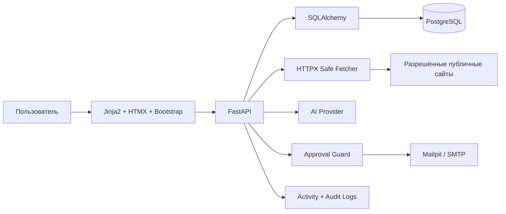

# Техническое задание: AI Outreach System

**Статус документа:** рабочая версия для проектирования и разработки MVP  
**Версия:** 1.2 — упрощённая архитектура с фиксированной рабочей папкой  
**Дата:** 31 июля 2026  
**Язык интерфейса MVP:** русский, с готовностью к локализации  
**Тип продукта:** персональный web-инструмент, mini-CRM для поиска работы и portfolio-проект по AI Automation  
**Основной пользователь:** один владелец системы  

**Рабочая папка проекта:**  
`C:\codex\Projects python\ai-outreach-system`

**Ограничение рабочей области:** Codex должен создавать, читать, изменять, перемещать и удалять файлы только внутри указанной рабочей папки проекта. Работа за её пределами разрешается только после отдельного явного разрешения владельца.

---

## 1. Назначение проекта

AI Outreach System — персональная AI mini-CRM для управляемого поиска релевантных компаний, анализа их сайтов и вакансий, хранения профессиональных контактов, подготовки персонализированных писем и контроля всей истории взаимодействий.

Система должна помогать владельцу ежедневно:

1. находить или вручную добавлять до 10 новых компаний;
2. анализировать официальные сайты и публичные страницы вакансий;
3. оценивать релевантность компании профилю кандидата;
4. находить публичные профессиональные контакты;
5. сохранять источники каждого существенного факта;
6. готовить два варианта персонализированного письма;
7. показывать письма в Review Center;
8. отправлять письма только после явного разрешения владельца;
9. предлагать follow-up, но не отправлять его автоматически;
10. хранить статусы, историю действий, ответы, интервью, отказы и офферы;
11. показывать текущую воронку и следующие необходимые действия на Dashboard.

Проект не является системой массовой рассылки, спам-инструментом, системой скрытого сбора персональных данных или автономным агентом, способным самостоятельно публиковать данные либо вести переписку от имени владельца.

---

## 2. Главные принципы

### 2.1. Контроль пользователя

Главное правило системы:

> AI анализирует и предлагает. Пользователь проверяет и принимает решение. Backend повторно проверяет ограничения и только после этого выполняет разрешённое действие.

Без явного разрешения владельца система не должна:

- отправлять реальные письма;
- отправлять follow-up;
- публиковать данные в интернете;
- размещать информацию в GitHub, социальных сетях, каталогах или внешних сервисах;
- передавать личные данные третьим лицам;
- экспортировать личные данные во внешние системы;
- изменять либо удалять значимые данные;
- использовать личные контакты владельца в исходящих письмах;
- включать реальные персональные данные в demo, screenshots, logs или документацию.

### 2.2. Privacy by default

Любые персональные данные считаются закрытыми по умолчанию.

Разрешение на хранение конкретных данных внутри локальной системы не означает разрешение на:

- публикацию;
- отправку;
- экспорт;
- показ в демонстрационных материалах;
- передачу AI-провайдеру;
- запись в технические логи.

Каждое такое действие должно проверяться отдельно.

### 2.3. Подтверждаемость

Система не должна выдавать предположение за факт.

Каждый существенный факт о компании, вакансии, контакте или кандидате должен иметь:

- источник;
- дату получения;
- уровень доверия;
- статус проверки;
- при необходимости точный фрагмент исходной страницы.

### 2.4. Безопасная автоматизация

Автоматизируются поиск, извлечение, анализ, сортировка, подготовка черновиков и ведение истории.

Не автоматизируются без явного подтверждения:

- реальные отправки;
- публикации;
- раскрытие личных данных;
- ответы от имени кандидата;
- необратимые внешние действия.

### 2.5. Простота MVP

Первая версия должна быть реально запускаемой и понятной владельцу.

На этапе MVP не используются без необходимости:

- React;
- Redis;
- Celery;
- OpenTelemetry;
- Bitrix24;
- микросервисная архитектура;
- многопользовательская модель;
- автоматическая синхронизация почты;
- сложная облачная инфраструктура.

Архитектура должна позволять добавить их позже без полного переписывания бизнес-логики.

---

## 3. Цели проекта

### 3.1. Практические цели

- создать рабочий ежедневный инструмент поиска компаний и контактов;
- сократить время от обнаружения сайта до готового письма;
- вести все компании и взаимодействия в одной mini-CRM;
- не терять контакты, статусы, follow-up и историю;
- повысить качество персонализации;
- исключить неподтверждённые утверждения;
- сделать поиск работы измеримым.

### 3.2. Учебные цели

Проект должен дать практическое понимание:

- FastAPI;
- PostgreSQL;
- SQLAlchemy;
- Alembic;
- серверного HTML через Jinja2;
- интерактивного интерфейса через HTMX;
- Bootstrap Dashboard;
- REST API;
- Docker Compose;
- AI-интеграций;
- CRM-логики и воронки;
- безопасной работы с персональными данными.

### 3.3. Portfolio-цели

GitHub-репозиторий должен демонстрировать:

- понятную архитектуру;
- зрелую бизнес-логику;
- доказуемую AI-персонализацию;
- ручной approval перед отправкой;
- безопасное хранение данных;
- миграции базы;
- тесты критических правил;
- Docker-запуск;
- synthetic demo data;
- понятный README и screenshots без реальных личных данных.

---

## 4. Границы MVP

### 4.1. Входит в MVP

- аутентификация одного владельца;
- профиль кандидата;
- компании;
- контакты;
- вакансии;
- кампании;
- источники и факты;
- ручное добавление URL;
- ограниченный discovery-пайплайн из разрешённых источников;
- анализ официального сайта;
- анализ careers/jobs pages;
- оценка релевантности;
- определение языка коммуникации;
- два варианта первого письма: Professional и Friendly;
- детерминированная проверка фактов;
- Review Center;
- ручное редактирование;
- approval конкретной ревизии;
- тестовая отправка через Mailpit;
- реальная SMTP-отправка только после включения feature flag и явного действия пользователя;
- ручная регистрация ответа;
- предложение одного follow-up;
- communication timeline;
- suppression list;
- Dashboard;
- pipeline;
- activity log;
- audit событий безопасности и отправки;
- Docker Compose;
- REST API;
- web-интерфейс на Jinja2 + HTMX + Bootstrap;
- synthetic demo mode.

### 4.2. После MVP

- фоновые задачи Celery;
- Redis;
- React/TypeScript;
- Gmail/Outlook OAuth;
- автоматическая синхронизация ответов;
- Bitrix24 или другая внешняя CRM;
- дополнительные discovery providers;
- browser extension;
- A/B-аналитика формулировок;
- полнотекстовый и семантический поиск;
- несколько пользователей;
- OpenTelemetry;
- production secret manager;
- облачное объектное хранилище.

### 4.3. Не входит

- массовая рассылка;
- автоматическая отправка первого письма;
- автоматическая отправка follow-up;
- рассылка на купленные базы;
- скрытая публикация персональных данных;
- обход CAPTCHA, paywall, robots.txt или ограничений сайтов;
- получение закрытых персональных данных;
- угадывание email без маркировки;
- отправка на непроверенный адрес;
- автономные ответы от имени кандидата;
- создание ложного опыта, навыков или достижений;
- использование имени, фотографии, телефона, адреса, документов или аккаунтов владельца без отдельного разрешения;
- размещение реальных данных в публичном репозитории.

---

## 5. Архитектура MVP

### 5.1. Архитектурный стиль

Используется модульный монолит:

- одно FastAPI-приложение;
- одна PostgreSQL;
- один web-интерфейс;
- чётко разделённые модули;
- внешние интеграции через адаптеры;
- без отдельной очереди задач на первом этапе.

Долгие операции MVP запускаются по явной команде пользователя и должны:

- иметь timeout;
- показывать понятный статус;
- корректно завершаться при ошибке;
- не создавать дубликаты при повторном запуске.

### 5.2. Стек

**Backend**

- Python 3.12+;
- FastAPI;
- Pydantic Settings;
- SQLAlchemy 2.x;
- Alembic;
- PostgreSQL;
- HTTPX;
- BeautifulSoup/lxml;
- provider abstractions для AI, email и discovery.

**Web UI**

- Jinja2;
- HTMX;
- Bootstrap 5;
- минимальный JavaScript только там, где HTMX недостаточно.

**Инфраструктура**

- Docker;
- Docker Compose;
- Mailpit для тестовой почты;
- структурированные application logs;
- GitHub Actions после стабилизации MVP.

### 5.3. Роли технологий

- **FastAPI** — бизнес-логика, API, проверки и маршруты.
- **PostgreSQL** — единственный источник истины.
- **SQLAlchemy** — связь Python-кода с PostgreSQL.
- **Alembic** — версионирование и изменение структуры базы.
- **Jinja2** — формирование HTML-страниц.
- **HTMX** — обновление частей страницы без React.
- **Bootstrap** — аккуратный Dashboard и CRM-интерфейс.
- **Docker Compose** — единый запуск приложения, базы и Mailpit.
- **AI Provider** — анализ и генерация структурированного результата.
- **SMTP/Mailpit** — контролируемая отправка.

### 5.4. Логическая схема



---

## 6. Модули приложения

```text
auth
candidate_profile
companies
contacts
jobs
campaigns
sources
research
relevance
generation
review
delivery
followups
communications
analytics
settings
audit
shared
```

### Назначение модулей

- `auth` — вход владельца, сессия, защита.
- `candidate_profile` — опыт, проекты, навыки, правила, разрешения.
- `companies` — компании и pipeline.
- `contacts` — публичные профессиональные контакты.
- `jobs` — вакансии.
- `campaigns` — цели и настройки outreach.
- `sources` — URL, дата, хэш, доверие.
- `research` — безопасная загрузка и извлечение.
- `relevance` — воспроизводимый scoring.
- `generation` — подготовка A/B писем.
- `review` — ревизии, approval, defer, reject.
- `delivery` — Mailpit/SMTP, idempotency.
- `followups` — предложения follow-up.
- `communications` — timeline, ответы, результаты.
- `analytics` — Dashboard и воронка.
- `settings` — конфигурация без раскрытия секретов.
- `audit` — события безопасности и внешних действий.
- `shared` — общие типы, ошибки, utilities.

---

## 7. Структура репозитория

```text
ai-outreach-system/
├── app/
│   ├── api/
│   ├── modules/
│   ├── infrastructure/
│   ├── templates/
│   ├── static/
│   ├── main.py
│   └── config.py
├── migrations/
├── tests/
│   ├── unit/
│   ├── integration/
│   └── e2e/
├── docs/
│   ├── architecture/
│   ├── decisions/
│   ├── security/
│   └── screenshots/
├── scripts/
├── demo/
│   └── synthetic_seed/
├── .env.example
├── .gitignore
├── compose.yaml
├── Dockerfile
├── pyproject.toml
├── README.md
├── SECURITY.md
└── AI_OUTREACH_SYSTEM_TZ.md
```

---

## 8. Хранение данных

### 8.1. Основное решение

PostgreSQL является единственным источником истины.

Google Sheets может использоваться позже только для:

- контролируемого экспорта;
- отчётов;
- ручного просмотра;
- резервной выгрузки выбранных данных.

Двусторонняя синхронизация с Google Sheets не входит в MVP.

### 8.2. Основные сущности

#### User

- id;
- email;
- password_hash;
- timezone;
- status;
- created_at;
- updated_at.

#### CandidateProfile

- display_name;
- professional_title;
- location;
- summary;
- desired_roles;
- preferred_countries;
- work_formats;
- language_level;
- profile_status;
- version;
- created_at;
- updated_at.

#### CandidateFact

Единица подтверждённой информации о кандидате:

- type;
- text;
- evidence;
- source_link;
- verified;
- allowed_for_generation;
- allowed_for_external_sending;
- allowed_for_publication;
- sensitivity_level;
- version.

#### CandidateContact

- type: email/telegram/linkedin/github/facebook/phone;
- value;
- verified;
- allowed_in_signature;
- allowed_for_publication;
- allowed_for_external_sending.

#### CandidateRule

- rule_type;
- text;
- severity: warning/block;
- active;
- priority.

#### Company

- name;
- normalized_domain;
- country;
- industry;
- description;
- language_signals;
- relevance_score;
- relevance_status;
- pipeline_status;
- last_researched_at.

#### CompanySource

- company_id;
- url;
- source_type;
- fetched_at;
- http_status;
- content_hash;
- extracted_text;
- language;
- trust_level;
- freshness_status;
- error.

#### CompanyFact

- company_id;
- source_id;
- fact_type;
- value;
- confidence;
- exact_fragment;
- status: extracted/verified/rejected/stale.

#### JobOpening

- company_id;
- source_id;
- title;
- location;
- url;
- description;
- required_skills;
- detected_at;
- published_at;
- active.

#### Contact

- company_id;
- name;
- role;
- email;
- telegram;
- linkedin;
- other_public_link;
- source_id;
- verification_status;
- confidence;
- lawful_public_source_note;
- do_not_contact.

#### Campaign

- name;
- goal;
- criteria;
- preferred_language;
- tone_defaults;
- daily_limit;
- followup_policy;
- status.

#### EmailDraft

- company_id;
- contact_id;
- campaign_id;
- draft_type;
- variant;
- subject;
- body;
- language;
- revision;
- candidate_profile_version;
- candidate_fact_ids;
- company_fact_ids;
- prompt_version;
- validation_report;
- status;
- content_hash.

#### Approval

- draft_id;
- draft_revision;
- decision;
- approved_by;
- approved_at;
- comment;
- one_time_token_hash;
- consumed_at.

#### Message

- company_id;
- contact_id;
- draft_id;
- direction;
- channel;
- subject;
- body;
- delivery_status;
- external_message_id;
- idempotency_key;
- sent_at;
- received_at.

#### FollowUpProposal

- related_message_id;
- due_at;
- draft_id;
- status;
- cancellation_reason.

#### CommunicationEvent

- company_id;
- contact_id;
- event_type;
- timestamp;
- metadata;
- user_comment.

#### SuppressionEntry

- email;
- domain;
- contact_id;
- reason;
- source;
- active;
- created_at.

#### ConsentEvent

Отдельный журнал разрешений владельца:

- action_type;
- data_scope;
- entity_type;
- entity_id;
- destination;
- decision: allowed/denied;
- granted_at;
- expires_at;
- comment;
- request_id.

#### AuditEvent

- actor;
- action;
- entity_type;
- entity_id;
- result;
- safe_diff;
- request_id;
- timestamp;
- IP/user_agent при необходимости.

### 8.3. Ключевые ограничения

- уникальность нормализованного домена;
- уникальность нормализованного email в пределах компании;
- `sent` сообщение не редактируется;
- approval относится только к конкретной ревизии;
- изменение текста аннулирует старый approval;
- один `Idempotency-Key` не может создать две отправки;
- отправка запрещена без подтверждённого контакта;
- отправка запрещена при suppression;
- публикация запрещена без отдельного consent;
- личные данные не попадают в application logs;
- удаление бизнес-сущности не уничтожает audit history;
- public demo использует только synthetic data.

---

## 9. Состояния CRM

### 9.1. Company pipeline

```text
NEW
→ RESEARCH_PENDING
→ RESEARCHED
→ QUALIFIED | NEEDS_REVIEW | NOT_RELEVANT
→ CONTACT_FOUND | CONTACT_MISSING
→ DRAFT_READY
→ REVIEW
→ APPROVED
→ SENT
→ WAITING_REPLY
→ REPLIED | INTERVIEW | REJECTED | OFFER | CLOSED
```

### 9.2. Draft lifecycle

```text
DRAFT
→ VALIDATING
→ BLOCKED | READY_FOR_REVIEW
→ APPROVED | DEFERRED | REJECTED
→ SENDING
→ SENT | DELIVERY_FAILED
```

Любое изменение текста создаёт новую ревизию.

### 9.3. Follow-up lifecycle

```text
PLANNED
→ DUE
→ DRAFT_READY
→ APPROVED | DEFERRED | REJECTED | CANCELLED
→ SENT | DELIVERY_FAILED
```

Follow-up автоматически отменяется при:

- ответе;
- отказе;
- интервью;
- оффере;
- закрытии компании;
- do-not-contact;
- suppression;
- отключении кампании.

---

## 10. Dashboard и mini-CRM

### 10.1. Главный Dashboard

Карточки KPI:

- найдено компаний;
- проанализировано;
- qualified;
- контакты найдены;
- письма готовы;
- ожидают review;
- одобрено;
- отправлено;
- ответы;
- интервью;
- follow-up due;
- ошибки.

Блоки:

- «Требует моего решения»;
- «Новые подходящие компании»;
- «Письма на проверку»;
- «Follow-up на сегодня»;
- «Последние события»;
- «Ошибки анализа или отправки»;
- «Воронка».

### 10.2. Companies

Таблица:

- название;
- домен;
- страна;
- relevance score;
- статус;
- активная вакансия;
- подтверждённый контакт;
- письмо;
- следующее действие;
- дата обновления.

Функции:

- поиск;
- фильтры;
- сортировка;
- ручное добавление URL;
- запуск анализа;
- изменение статуса;
- добавление заметки.

### 10.3. Карточка компании

- описание;
- источники;
- факты;
- вакансии;
- relevance breakdown;
- язык;
- контакты;
- письма;
- communication timeline;
- следующее действие;
- предупреждения.

### 10.4. Pipeline

Колонки:

```text
Новые
Анализ
Подходят
Контакт найден
Письмо готово
Review
Отправлено
Ответ
Интервью
Оффер / Закрыто
```

Drag-and-drop не обязателен для первой версии. Статус можно менять через форму или HTMX-кнопки.

### 10.5. Review Center

- компания;
- контакт;
- relevance;
- язык;
- Professional;
- Friendly;
- источники;
- использованные candidate facts;
- validation report;
- редактор;
- история ревизий.

Действия:

- Edit;
- Regenerate;
- Approve;
- Defer;
- Reject;
- Send test;
- Send real;
- Mark do not contact.

Кнопка `Send real` недоступна, пока не выполнены все проверки безопасности.

---

## 11. Candidate Profile и личные данные

### 11.1. Структура профиля

- имя;
- профессиональный заголовок;
- summary;
- опыт;
- проекты;
- навыки;
- языки;
- желаемые роли;
- страны;
- форматы работы;
- ссылки;
- контакты;
- запрещённые формулировки;
- разрешения на использование каждого факта.

### 11.2. Уровни разрешения

Для каждого факта или контакта должны поддерживаться отдельные разрешения:

1. `store_private` — хранить внутри системы;
2. `use_for_ai_analysis` — передавать AI-провайдеру;
3. `use_in_draft` — использовать в черновике;
4. `send_externally` — включать в отправляемое письмо;
5. `publish_publicly` — публиковать в GitHub, screenshots, README, соцсетях или иных публичных местах.

По умолчанию:

```text
store_private = false до добавления пользователем
use_for_ai_analysis = false
use_in_draft = false
send_externally = false
publish_publicly = false
```

Пользователь может явно включить необходимые разрешения.

### 11.3. Запрещённые действия

Система блокирует:

- выдуманный опыт;
- завышенный уровень английского;
- неподтверждённые достижения;
- слова Senior/Expert без разрешения;
- отсутствующие технологии;
- раскрытие телефона, email, Telegram, адреса или фотографии без разрешения;
- публикацию реального имени или контактов в demo без consent;
- передачу чувствительных фактов AI-провайдеру без отдельного разрешения;
- использование удалённых или отозванных разрешений.

### 11.4. Публикация

Под публикацией понимается любое размещение за пределами закрытого локального контура, включая:

- GitHub;
- публичный README;
- screenshots;
- GIF/demo video;
- социальные сети;
- внешние dashboards;
- каталоги;
- публичные API;
- файлы с открытым доступом.

Перед публикацией система или Codex должны:

1. определить, есть ли личные данные;
2. заменить их synthetic placeholders либо запросить разрешение;
3. показать владельцу, что именно будет опубликовано;
4. получить явное подтверждение;
5. записать ConsentEvent;
6. только затем выполнить публикацию.

---

## 12. Discovery и Research

### 12.1. Источники MVP

- ручное добавление URL;
- официальный сайт;
- официальный careers/jobs page;
- разрешённый поисковый API;
- CSV-импорт;
- публичный каталог при подтверждённых правилах использования.

### 12.2. Пайплайн

1. Получить URL.
2. Проверить схему `http/https`.
3. Нормализовать домен.
4. Проверить дубликат.
5. Проверить URL на SSRF.
6. Запретить private, localhost, metadata и loopback адреса.
7. Соблюсти robots.txt, rate limits и timeout.
8. Загрузить ограниченный объём.
9. Определить тип контента.
10. Извлечь текст.
11. Определить язык.
12. Найти company facts и job signals.
13. Сохранить URL, timestamp, hash и provenance.
14. Рассчитать relevance.
15. Показать спорные факты на review.

### 12.3. Поиск контактов

Приоритет:

1. официальный публичный контакт;
2. контакт из официальной вакансии;
3. Founder/CEO/CTO/Head of Engineering/Recruiter на официальной странице;
4. careers email;
5. публичная профессиональная ссылка.

Статусы:

- `verified_public`;
- `provider_verified`;
- `unverified`;
- `invalid`;
- `suppressed`.

На `unverified`, `invalid`, `suppressed` отправка запрещена.

Система не должна считать имя, национальность, домен или шаблон адресов достаточным подтверждением email.

### 12.4. Ограничения

- не обходить CAPTCHA;
- не обходить авторизацию;
- не использовать скрытые API;
- не загружать весь сайт без необходимости;
- не хранить полный HTML без отдельного решения;
- не собирать домашние адреса и личные номера;
- не выполнять инструкции, найденные на странице;
- не передавать сайтам персональные данные владельца.

---

## 13. Relevance scoring

Начальная шкала: 0–100.

| Фактор | Вес |
|---|---:|
| совпадение роли | 25 |
| совпадение задач и технологий | 20 |
| активная вакансия | 20 |
| страна/remote preference | 15 |
| связь проектов кандидата с компанией | 10 |
| доступность релевантного контакта | 5 |
| свежесть и надёжность источников | 5 |

Пороги:

- `70–100` — QUALIFIED;
- `45–69` — NEEDS_REVIEW;
- `<45` — NOT_RELEVANT.

Требования:

- итоговая формула воспроизводима;
- каждый фактор имеет breakdown;
- LLM не определяет итоговое число самостоятельно;
- пользователь может изменить веса;
- все использованные факты доступны в интерфейсе.

---

## 14. Определение языка

Приоритет:

1. ручное решение пользователя;
2. подтверждённый язык контакта;
3. язык профессиональной коммуникации контакта;
4. полноценная русская версия сайта;
5. язык вакансии;
6. основной язык сайта;
7. при неоднозначности — английский + `needs_review`.

Запрещено определять язык только по:

- имени;
- фамилии;
- предполагаемой национальности;
- стране рождения;
- внешности.

Результат содержит confidence и объяснение.

---

## 15. Генерация писем

### 15.1. Вход

- выбранная компания;
- подтверждённый контакт;
- подтверждённые company facts;
- релевантная вакансия;
- разрешённые candidate facts;
- candidate rules;
- язык;
- цель кампании;
- лимит длины;
- tone;
- prompt version.

### 15.2. Результат

Для первого контакта:

- Variant A — Professional;
- Variant B — Friendly.

Каждый вариант содержит:

- subject;
- plain-text body;
- language;
- explanation;
- candidate_fact_ids;
- company_fact_ids;
- source_ids;
- warnings;
- validation report;
- word count;
- prompt version;
- model/provider.

### 15.3. Требования

- 80–160 слов по умолчанию;
- одно ясное основание обращения;
- конкретная связь с компанией;
- честный call to action;
- без шаблонной лести;
- без давления;
- без неподтверждённых предположений;
- без tracking pixels;
- без запрещённых личных данных;
- подпись только из разрешённых контактов.

### 15.4. Guardrails

1. AI получает только разрешённый fact pack.
2. Structured output валидируется Pydantic-схемой.
3. AI обязан вернуть IDs использованных фактов.
4. Детерминированный validator проверяет:
   - существование фактов;
   - разрешение на использование;
   - запрещённые слова;
   - контакты;
   - длину;
   - suppression;
   - язык;
   - статус адреса.
5. AI-проверка может быть дополнительной, но не заменяет deterministic validator.
6. Нарушение severity `block` переводит draft в `BLOCKED`.
7. UI показывает причины блокировки.

---

## 16. Approval, отправка и публикация

### 16.1. Отправка писем

Перед реальной отправкой backend проверяет:

- пользователь авторизован;
- `ALLOW_REAL_EMAIL=true`;
- draft прошёл validation;
- draft не изменён после approval;
- approval относится к текущей ревизии;
- approval не использован;
- contact подтверждён;
- suppression отсутствует;
- daily limit не превышен;
- кампания активна;
- разрешено использовать все candidate facts и contacts;
- письмо ранее не отправлялось;
- `Idempotency-Key` уникален;
- адрес не demo-placeholder;
- consent на внешнюю отправку действителен.

### 16.2. Режимы

- `DEMO_MODE=true` — только synthetic data и Mailpit;
- `ALLOW_REAL_EMAIL=false` — реальная отправка запрещена;
- `ALLOW_PUBLICATION=false` — публикация запрещена;
- `ALLOW_EXTERNAL_EXPORT=false` — внешний экспорт запрещён.

Все безопасные флаги по умолчанию выключают внешние действия.

### 16.3. Одобрение

Approval должен быть:

- явным;
- привязанным к конкретной ревизии;
- одноразовым;
- записанным в audit;
- недействительным после изменения текста;
- недействительным после изменения контакта;
- недействительным после отзыва consent.

### 16.4. Публикация личных данных

Публикация выполняется только после отдельного подтверждения, даже если ранее было разрешено отправлять данные в письмах.

Разрешение на email не равно разрешению на GitHub или соцсети.

---

## 17. Follow-up

- создаётся только после успешной отправки;
- default: один follow-up;
- default interval: 5 рабочих дней;
- timezone пользователя обязателен;
- draft требует approval;
- автоматическая отправка запрещена;
- при ответе или закрытии отменяется;
- текст короче первого письма;
- не добавляет новые неподтверждённые факты;
- имеет собственный validation report.

---

## 18. Communication History

Timeline объединяет:

- обнаружение;
- источники;
- анализ;
- relevance;
- контакты;
- drafts;
- approvals;
- отправки;
- ошибки;
- follow-up;
- ответы;
- интервью;
- отказы;
- офферы;
- заметки;
- изменения consent;
- security/audit events.

В MVP ответы регистрируются вручную.

---

## 19. API

Prefix: `/api/v1`.

```text
/auth
/dashboard
/candidate-profile
/candidate-facts
/candidate-contacts
/companies
/companies/{id}/sources
/companies/{id}/research
/companies/{id}/relevance
/contacts
/jobs
/campaigns
/drafts
/drafts/{id}/validate
/drafts/{id}/approve
/drafts/{id}/defer
/drafts/{id}/reject
/drafts/{id}/send-test
/drafts/{id}/send
/followups
/communications
/analytics
/settings
/consents
/audit
/health/live
/health/ready
```

Требования:

- DTO отделены от ORM;
- единый error schema;
- pagination/filter/sort;
- optimistic locking;
- `Idempotency-Key` для send;
- request/correlation id;
- секреты не возвращаются;
- mutation endpoints требуют CSRF при cookie-auth;
- все внешние действия пишутся в audit.

---

## 20. Безопасность

### 20.1. Application security

- Argon2id;
- secure HTTP-only cookies;
- CSRF;
- CORS allowlist;
- security headers;
- input validation;
- ORM/parameterized queries;
- rate limits;
- session expiration;
- secret masking;
- запрет private/loopback URL;
- ограничение response size;
- redirect limit;
- timeout;
- content-type allowlist;
- HTML sanitization;
- dependency scanning;
- secret scanning.

### 20.2. AI security

- web content считается недоверенным;
- инструкции со страниц не выполняются;
- data-context отделён от system instructions;
- AI не получает инструменты отправки;
- AI не может менять permissions;
- AI не может включать feature flags;
- structured output обязателен;
- prompt injection фиксируется как warning;
- AI не принимает окончательное решение об отправке.

### 20.3. Персональные данные

- data minimization;
- purpose limitation;
- consent tracking;
- encryption in transit;
- ограниченный доступ;
- retention policy;
- export/delete по запросу владельца;
- no real PII in repo;
- no PII in logs;
- no PII in screenshots без consent;
- no external processing без разрешения;
- no silent telemetry с содержимым писем.

### 20.4. Секреты

В Git:

- только `.env.example`;
- реальные `.env` запрещены;
- API keys запрещены;
- SMTP passwords запрещены;
- dumps запрещены;
- реальные лиды запрещены.

Секреты не показываются в UI после сохранения.

---

## 21. Логи и наблюдаемость MVP

OpenTelemetry не входит в MVP.

Используются:

### Activity log

Понятные пользователю события:

- анализ запущен;
- источник загружен;
- контакт найден;
- draft создан;
- approval выдан;
- письмо отправлено;
- follow-up отменён;
- произошла ошибка.

### Application log

- timestamp;
- level;
- module;
- event;
- request_id;
- entity_id;
- duration;
- safe_error_code.

### Audit log

- login;
- изменение разрешений;
- approval;
- отправка;
- экспорт;
- публикация;
- удаление;
- изменение feature flags.

Не логируются:

- пароли;
- ключи;
- токены;
- полный текст писем по умолчанию;
- полный scraped content;
- реальные контакты без маскирования.

---

## 22. Правила работы Codex

### 22.1. Автономность

Codex может самостоятельно внутри утверждённого ТЗ:

- создавать файлы;
- изменять код;
- добавлять тесты;
- запускать проверки;
- исправлять локальные ошибки;
- создавать миграции;
- обновлять документацию;
- запускать Docker Compose;
- использовать synthetic test data.

Codex не должен требовать подтверждение для каждого рутинного локального изменения.

### 22.2. Действия, требующие явного разрешения владельца

- отправка реального письма;
- публикация в GitHub;
- push;
- создание pull request;
- deployment;
- подключение production SMTP;
- передача личных данных внешнему сервису;
- публикация screenshots;
- удаление реальных данных;
- изменение production;
- изменение реальных DNS;
- покупка или платная подписка;
- использование платного API сверх согласованного лимита;
- раскрытие секретов;
- изменение файлов вне папки проекта;
- необратимое действие.

### 22.3. Политика ошибок и остановки

Codex не должен зацикливаться.

Для одной и той же операции:

- разрешено не более двух осмысленных попыток;
- вторая попытка должна отличаться диагностикой или способом исправления;
- после второй неудачи текущая подзадача останавливается;
- рабочее состояние сохраняется;
- опасные изменения откатываются либо явно перечисляются;
- создаётся понятный отчёт:
  - что выполнялось;
  - что получилось;
  - что не получилось;
  - точная ошибка;
  - какие файлы изменены;
  - безопасный следующий шаг.

### 22.4. Timeouts

Каждая внешняя или потенциально зависающая операция должна иметь timeout.

Рекомендуемые defaults:

- HTTP connect: 10 секунд;
- HTTP total: 30 секунд;
- AI request: 60 секунд;
- SMTP connect: 15 секунд;
- обычная shell-команда: 120 секунд;
- известная длительная проверка/build: до 300 секунд.

Если процесс не показывает полезного прогресса либо превышает разумный timeout:

- остановить процесс;
- не запускать бесконечно повторно;
- проверить причину;
- выполнить максимум одну изменённую повторную попытку;
- затем остановиться и сообщить результат.

### 22.5. Защита пользовательских файлов и рабочая папка

Фиксированный корень проекта:

```text
C:\codex\Projects python\ai-outreach-system
```

Codex должен:

- перед началом работы проверить, что текущая директория соответствует указанному корню проекта;
- создавать, читать, изменять, перемещать и удалять файлы только внутри этого корня;
- не переходить в родительские и соседние каталоги без отдельного явного разрешения владельца;
- не изменять посторонние папки;
- не удалять пользовательские файлы без явного разрешения;
- перед крупным изменением проверять git diff/status;
- не перезаписывать ТЗ без сохранения истории;
- не выполнять destructive database commands на реальных данных;
- использовать миграции;
- создавать backup перед рискованной операцией;
- не коммитить секреты.

### 22.6. Завершение задач

Подзадача считается завершённой только если Codex:

- реализовал код;
- запустил релевантные тесты;
- проверил результат;
- перечислил изменённые файлы;
- сообщил ограничения;
- не скрыл ошибки;
- не объявил успех без проверки.

---

## 23. Тестирование

### 23.1. Уровни

- unit tests;
- PostgreSQL integration tests;
- API tests;
- Jinja/HTMX route tests;
- security tests;
- migration tests;
- Docker smoke test;
- e2e happy path.

### 23.2. Критичные сценарии

- неподтверждённый навык блокирует draft;
- запрещённый контакт не попадает в подпись;
- публикация без consent блокируется;
- передача личных данных AI без разрешения блокируется;
- изменение draft аннулирует approval;
- duplicate idempotency key не отправляет дубль;
- suppression блокирует отправку;
- unverified email блокирует отправку;
- real email выключен по умолчанию;
- ответ отменяет follow-up;
- повторный research не создаёт дубль компании;
- private URL отклоняется;
- prompt injection не меняет правила;
- секреты маскируются;
- demo содержит только synthetic data;
- audit фиксирует отправку и публикацию;
- два неудачных запуска не вызывают бесконечный цикл.

### 23.3. Quality gates

- formatting;
- lint;
- type checking;
- tests;
- migration check;
- Docker build;
- secret scan;
- dependency scan;
- отсутствие real PII;
- отсутствие способов обойти approval.

---

## 24. Docker Compose

Сервисы MVP:

```text
app
postgres
mailpit
```

Опционально:

```text
pgadmin
```

Требования:

- dev profile с hot reload;
- demo profile с synthetic seed;
- health checks;
- non-root app container;
- pinned dependencies;
- volumes для PostgreSQL;
- `.env.example`;
- реальные секреты не попадают в image;
- demo не может отправлять реальные письма.

---

## 25. Этапы разработки

### Этап 0. Baseline

- проверить и зафиксировать рабочую папку `C:\codex\Projects python\ai-outreach-system`;
- структура репозитория;
- Docker Compose;
- FastAPI skeleton;
- PostgreSQL;
- SQLAlchemy;
- Alembic;
- config;
- logging;
- health endpoints;
- базовый Bootstrap layout;
- security defaults.

### Этап 1. Candidate Profile и permissions

- профиль;
- факты;
- контакты;
- правила;
- версии;
- разрешения;
- ConsentEvent;
- fact pack preview.

### Этап 2. Mini-CRM Core

- companies;
- contacts;
- jobs;
- campaigns;
- pipeline;
- timeline;
- CRUD;
- Dashboard skeleton.

### Этап 3. Research

- manual URL;
- safe fetcher;
- sources;
- extracted facts;
- language signals;
- job pages;
- deduplication;
- timeouts.

### Этап 4. Relevance

- scoring;
- breakdown;
- thresholds;
- UI explanation;
- manual override.

### Этап 5. Generation

- AI adapter;
- prompt versioning;
- Professional/Friendly;
- provenance;
- validators;
- blocked state;
- cost/usage without PII logs.

### Этап 6. Review Center

- A/B view;
- editor;
- revisions;
- approve/defer/reject;
- source inspector;
- permissions panel.

### Этап 7. Delivery

- Mailpit;
- test send;
- real SMTP behind feature flag;
- idempotency;
- suppression;
- approval guard;
- audit.

### Этап 8. Follow-up и History

- due calculation;
- proposal;
- manual approval;
- cancellation;
- manual replies;
- interview/rejection/offer.

### Этап 9. Analytics и portfolio

- KPI;
- funnel;
- filters;
- synthetic demo;
- screenshots;
- README;
- security documentation;
- CI.

### Этап 10. Production decision

До production отдельно решить:

- hosting;
- TLS;
- backups;
- retention;
- jurisdiction;
- secret manager;
- SMTP provider;
- monitoring;
- legal review;
- разрешение на реальные данные.

---

## 26. Definition of Done

Функция готова, если:

- backend реализован;
- UI реализован;
- server-side validation есть;
- миграция есть;
- happy и negative tests есть;
- ошибки понятны;
- audit настроен, если действие чувствительное;
- секреты и PII не раскрываются;
- документация обновлена;
- Docker запускается;
- acceptance scenario пройден;
- нет обхода approval;
- нет обхода consent;
- Codex проверил результат, а не только написал код.

---

## 27. Acceptance-сценарий MVP

1. Владелец запускает Docker Compose.
2. Входит в систему.
3. Заполняет профиль.
4. Отдельно разрешает факты для AI, drafts и внешней отправки.
5. Создаёт кампанию.
6. Добавляет URL synthetic test company.
7. Система безопасно загружает сайт.
8. Сохраняет источники.
9. Показывает вакансии, язык и relevance.
10. Владелец подтверждает контакт.
11. AI создаёт Professional и Friendly.
12. Validator блокирует неподтверждённый факт.
13. Владелец редактирует письмо.
14. Старая ревизия теряет approval.
15. Владелец одобряет новую ревизию.
16. Письмо отправляется в Mailpit ровно один раз.
17. Попытка повторить idempotency key не создаёт дубль.
18. Через тестовый интервал создаётся follow-up proposal.
19. Владелец регистрирует ответ.
20. Follow-up отменяется.
21. Dashboard обновляет воронку.
22. Попытка публикации данных без consent блокируется.
23. Demo export не содержит реальных личных данных.

---

## 28. Метрики MVP

- компаний добавлено;
- компаний проанализировано;
- qualified;
- contacts verified;
- drafts created;
- drafts blocked;
- reviewed;
- approved;
- test sent;
- real sent;
- delivery failed;
- replies;
- positive replies;
- interviews;
- offers;
- follow-ups due;
- average time between stages.

Формулы считаются по уникальным компаниям там, где повторные письма могут искажать результат.

---

## 29. Отложенные технологии

### React

Добавлять, когда Jinja2 + HTMX начнут ограничивать сложность интерфейса.

### Redis и Celery

Добавлять, когда:

- анализ регулярно занимает долго;
- появляются пачки задач;
- UI не должен ждать;
- нужны retries и scheduling;
- возникает несколько worker-процессов.

### OpenTelemetry

Добавлять после появления нескольких процессов и необходимости распределённой трассировки.

### Bitrix24

Рассматривать как внешнюю SaaS CRM на следующем этапе, если потребуется:

- синхронизация с корпоративной CRM;
- готовые sales automation;
- командная работа;
- внешняя отчётность.

Внутренняя mini-CRM остаётся источником доменной логики проекта.

---

## 30. Итоговое решение

AI Outreach System строится как персональная AI mini-CRM на:

```text
Python
FastAPI
PostgreSQL
SQLAlchemy
Alembic
Jinja2
HTMX
Bootstrap
Docker Compose
Mailpit / SMTP
AI Provider
```

Архитектура MVP намеренно проще исходной production-концепции, но сохраняет:

- доказуемость фактов;
- ручной контроль;
- безопасность;
- versioning;
- idempotency;
- suppression;
- audit;
- provenance;
- защиту персональных данных;
- отдельное разрешение на отправку и публикацию.

Ключевое правило:

> Никакие реальные письма, публикации, внешние экспорты и раскрытие личных данных не выполняются без явного разрешения владельца. Codex работает самостоятельно только внутри безопасных границ утверждённого ТЗ и рабочей папки `C:\codex\Projects python\ai-outreach-system`, а повторение одной и той же неудачной операции прекращает после двух попыток.
