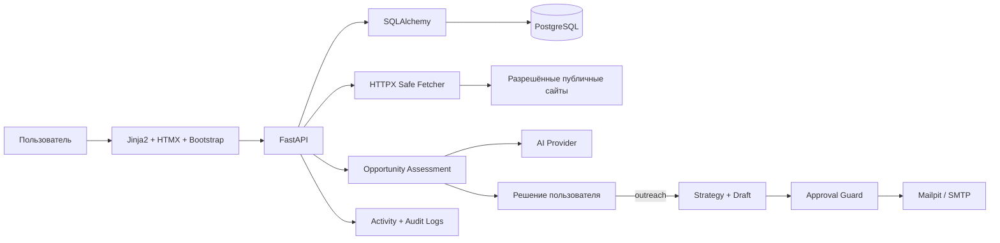

# Техническое задание: Outreach Opportunity System

**Статус документа:** рабочая версия для проектирования и разработки MVP  
**Версия:** 1.3 — opportunity-first модель карьерного outreach  
**Дата:** 1 августа 2026  
**Язык интерфейса MVP:** русский, с готовностью к локализации  
**Тип продукта:** персональная AI-система поиска и создания карьерных возможностей, mini-CRM и portfolio-проект по AI Automation  
**Основной пользователь:** один владелец системы  

**Рабочая папка проекта:**  
`C:\codex\Projects python\ai-outreach-system`

**Ограничение рабочей области:** Codex должен создавать, читать, изменять, перемещать и удалять файлы только внутри указанной рабочей папки проекта. Работа за её пределами разрешается только после отдельного явного разрешения владельца.

---

## 1. Назначение проекта

Outreach Opportunity System — персональная AI-система для управляемого поиска и создания карьерных возможностей по всему миру. Система находит и анализирует компании, которым могут быть полезны опыт, компетенции и сочетание управленческого background владельца с практической AI Automation, хранит профессиональные контакты, готовит рекомендации и только после решения владельца — персонализированные письма.

Вакансия является сильным opportunity signal, но не обязательным условием для добавления, анализа или признания компании релевантной. Центральный вопрос системы:

> Чем занимается компания, какие у неё есть текущие или потенциальные задачи, где опыт владельца способен принести пользу и какой реалистичный формат сотрудничества можно предложить?

Система рассматривает стартапы, небольшой и средний бизнес, крупные международные, зрелые и известные компании любого размера и стадии. Отсутствие активного роста, инвестиций, найма или вакансии само по себе не снижает релевантность и не блокирует анализ.

Система должна помогать владельцу ежедневно:

1. находить или вручную добавлять до 10 новых компаний;
2. анализировать деятельность, задачи, официальный сайт, публичные материалы и при наличии страницы вакансий;
3. выявлять opportunity types и подтверждённые opportunity signals;
4. отдельно оценивать business, AI automation, hybrid, format и geography fit;
5. рекомендовать позиционирование, формат сотрудничества и возможную роль владельца;
6. находить первого и второго по приоритету публичного decision-maker;
7. сохранять источники каждого существенного факта, сигнала и вывода;
8. показывать recommendation, причины писать, причины не писать, риски и следующее действие;
9. позволять владельцу решить: писать, отложить, исследовать глубже, отклонить или добавить в watchlist;
10. готовить два варианта персонализированного письма только после решения владельца;
11. показывать письма в Review Center;
12. отправлять письма только после явного разрешения владельца;
13. предлагать follow-up, но не отправлять его автоматически;
14. хранить статусы, историю действий, ответы, интервью, обсуждения проектов, отказы, офферы и соглашения;
15. показывать текущую opportunity-воронку и следующие необходимые действия на Dashboard.

Проект не является системой массовой рассылки, спам-инструментом, системой скрытого сбора персональных данных или автономным агентом, способным самостоятельно решать, кому писать, создавать письма до решения владельца, публиковать данные либо вести переписку от имени владельца.

---

## 2. Главные принципы

### 2.1. Контроль пользователя

Главное правило системы:

> AI анализирует и предлагает. Пользователь проверяет и принимает решение. Backend повторно проверяет ограничения и только после этого выполняет разрешённое действие.

Без явного разрешения владельца система не должна:

- отправлять реальные письма;
- отправлять follow-up;
- публиковать данные в интернете;
- размещать информацию в GitHub, социальных сетях, каталогах или внешних сервисах;
- передавать личные данные третьим лицам;
- экспортировать личные данные во внешние системы;
- изменять либо удалять значимые данные;
- использовать личные контакты владельца в исходящих письмах;
- включать реальные персональные данные в demo, screenshots, logs или документацию.

### 2.2. Privacy by default

Любые персональные данные считаются закрытыми по умолчанию.

Разрешение на хранение конкретных данных внутри локальной системы не означает разрешение на:

- публикацию;
- отправку;
- экспорт;
- показ в демонстрационных материалах;
- передачу AI-провайдеру;
- запись в технические логи.

Каждое такое действие должно проверяться отдельно.

### 2.3. Подтверждаемость

Система не должна выдавать предположение за факт.

Каждый существенный факт о компании, вакансии, контакте или кандидате должен иметь:

- источник;
- дату получения;
- уровень доверия;
- статус проверки;
- при необходимости точный фрагмент исходной страницы.

### 2.4. Безопасная автоматизация

Автоматизируются поиск, извлечение, анализ, сортировка, подготовка черновиков и ведение истории.

Не автоматизируются без явного подтверждения:

- окончательное решение о целесообразности outreach;
- перевод компании в `APPROVED_FOR_OUTREACH`;
- создание реального outreach draft до решения владельца;
- реальные отправки;
- публикации;
- раскрытие личных данных;
- ответы от имени кандидата;
- необратимые внешние действия.

### 2.5. Простота MVP

Первая версия должна быть реально запускаемой и понятной владельцу.

На этапе MVP не используются без необходимости:

- React;
- Redis;
- Celery;
- OpenTelemetry;
- Bitrix24;
- микросервисная архитектура;
- многопользовательская модель;
- автоматическая синхронизация почты;
- сложная облачная инфраструктура.

Архитектура должна позволять добавить их позже без полного переписывания бизнес-логики.

---

## 3. Цели проекта

### 3.1. Практические цели

- создать рабочий ежедневный инструмент поиска и оценки карьерных возможностей;
- принимать и обрабатывать ориентировочно до 10 новых компаний в сутки без обязанности писать всем;
- находить релевантность компании даже без вакансии или публичного события роста;
- объяснимо выбирать Business-first, AI-first или Hybrid позиционирование;
- сократить время от обнаружения компании до проверенной recommendation и осознанного решения;
- вести все компании и взаимодействия в одной mini-CRM;
- не терять контакты, статусы, follow-up и историю;
- повысить качество ценностного предложения и персонализации;
- исключить неподтверждённые утверждения;
- сделать поиск работы измеримым.

### 3.2. Учебные цели

Проект должен дать практическое понимание:

- FastAPI;
- PostgreSQL;
- SQLAlchemy;
- Alembic;
- серверного HTML через Jinja2;
- интерактивного интерфейса через HTMX;
- Bootstrap Dashboard;
- REST API;
- Docker Compose;
- AI-интеграций;
- CRM-логики и воронки;
- безопасной работы с персональными данными.

### 3.3. Portfolio-цели

GitHub-репозиторий должен демонстрировать:

- понятную архитектуру;
- зрелую бизнес-логику;
- доказуемую AI-персонализацию;
- ручной approval перед отправкой;
- безопасное хранение данных;
- миграции базы;
- тесты критических правил;
- Docker-запуск;
- synthetic demo data;
- понятный README и screenshots без реальных личных данных.

---

## 4. Границы MVP

### 4.1. Входит в MVP

- аутентификация одного владельца;
- профиль кандидата;
- компании;
- контакты;
- вакансии;
- opportunity types;
- opportunity signals;
- opportunity assessment и recommendation;
- decision-makers;
- стратегии позиционирования Business-first, AI-first и Hybrid;
- кампании;
- источники и факты;
- ручное добавление URL;
- ограниченный discovery-пайплайн из разрешённых источников;
- анализ официального сайта;
- анализ careers/jobs pages при их наличии;
- opportunity-first оценка релевантности, не зависящая от обязательной вакансии;
- варианты сотрудничества: employment, project, contract, consulting, advisory и local representation;
- решения писать/defer/deeper research/not relevant/watchlist;
- определение языка коммуникации;
- два варианта первого письма: Professional и Friendly;
- детерминированная проверка фактов;
- Review Center;
- ручное редактирование;
- approval конкретной ревизии;
- тестовая отправка через Mailpit;
- реальная SMTP-отправка только после включения feature flag и явного действия пользователя;
- ручная регистрация ответа;
- предложение одного follow-up;
- communication timeline;
- suppression list;
- Dashboard;
- pipeline;
- activity log;
- audit событий безопасности и отправки;
- Docker Compose;
- REST API;
- web-интерфейс на Jinja2 + HTMX + Bootstrap;
- synthetic demo mode.

### 4.2. После MVP

- фоновые задачи Celery;
- Redis;
- React/TypeScript;
- Gmail/Outlook OAuth;
- автоматическая синхронизация ответов;
- Bitrix24 или другая внешняя CRM;
- дополнительные discovery providers;
- browser extension;
- A/B-аналитика формулировок;
- полнотекстовый и семантический поиск;
- несколько пользователей;
- OpenTelemetry;
- production secret manager;
- облачное объектное хранилище.

### 4.3. Не входит

- массовая рассылка;
- автоматическая отправка первого письма;
- автоматическая отправка follow-up;
- рассылка на купленные базы;
- скрытая публикация персональных данных;
- обход CAPTCHA, paywall, robots.txt или ограничений сайтов;
- получение закрытых персональных данных;
- угадывание email без маркировки;
- отправка на непроверенный адрес;
- автономные ответы от имени кандидата;
- автономное решение AI о том, кому писать;
- автоматическое создание писем для всех найденных компаний до решения владельца;
- создание ложного опыта, навыков или достижений;
- использование имени, фотографии, телефона, адреса, документов или аккаунтов владельца без отдельного разрешения;
- размещение реальных данных в публичном репозитории.

---

## 5. Архитектура MVP

### 5.1. Архитектурный стиль

Используется модульный монолит:

- одно FastAPI-приложение;
- одна PostgreSQL;
- один web-интерфейс;
- чётко разделённые модули;
- внешние интеграции через адаптеры;
- без отдельной очереди задач на первом этапе.

Долгие операции MVP запускаются по явной команде пользователя и должны:

- иметь timeout;
- показывать понятный статус;
- корректно завершаться при ошибке;
- не создавать дубликаты при повторном запуске.

### 5.2. Стек

**Backend**

- Python 3.12+;
- FastAPI;
- Pydantic Settings;
- SQLAlchemy 2.x;
- Alembic;
- PostgreSQL;
- HTTPX;
- BeautifulSoup/lxml;
- provider abstractions для AI, email и discovery.

**Web UI**

- Jinja2;
- HTMX;
- Bootstrap 5;
- минимальный JavaScript только там, где HTMX недостаточно.

**Инфраструктура**

- Docker;
- Docker Compose;
- Mailpit для тестовой почты;
- структурированные application logs;
- GitHub Actions после стабилизации MVP.

### 5.3. Роли технологий

- **FastAPI** — бизнес-логика, API, проверки и маршруты.
- **PostgreSQL** — единственный источник истины.
- **SQLAlchemy** — связь Python-кода с PostgreSQL.
- **Alembic** — версионирование и изменение структуры базы.
- **Jinja2** — формирование HTML-страниц.
- **HTMX** — обновление частей страницы без React.
- **Bootstrap** — аккуратный Dashboard и CRM-интерфейс.
- **Docker Compose** — единый запуск приложения, базы и Mailpit.
- **AI Provider** — анализ и генерация структурированного результата.
- **SMTP/Mailpit** — контролируемая отправка.

### 5.4. Логическая схема



---

## 6. Модули приложения

```text
auth
candidate_profile
companies
contacts
jobs
campaigns
opportunities
sources
research
relevance
strategy
generation
review
delivery
followups
communications
analytics
settings
audit
shared
```

### Назначение модулей

- `auth` — вход владельца, сессия, защита.
- `candidate_profile` — широкая анкета: опыт, навыки, сильные стороны, предпочтения, география, форматы, правила и разрешения.
- `companies` — компании любого размера и стадии, opportunity pipeline.
- `contacts` — публичные профессиональные контакты и decision-makers.
- `jobs` — вакансии как один из сигналов, а не обязательное условие opportunity.
- `campaigns` — цели, opportunity criteria и настройки outreach.
- `opportunities` — типы возможностей, сигналы, assessment, решения и watchlist.
- `sources` — URL, дата, хэш, доверие.
- `research` — безопасная загрузка, извлечение фактов, задач и opportunity signals.
- `relevance` — многомерный воспроизводимый opportunity scoring.
- `strategy` — выбор Business-first, AI-first или Hybrid, роли, формата и decision-makers.
- `generation` — подготовка A/B писем.
- `review` — ревизии, approval, defer, reject.
- `delivery` — Mailpit/SMTP, idempotency.
- `followups` — предложения follow-up.
- `communications` — timeline, ответы, результаты.
- `analytics` — Dashboard и воронка.
- `settings` — конфигурация без раскрытия секретов.
- `audit` — события безопасности и внешних действий.
- `shared` — общие типы, ошибки, utilities.

---

## 7. Структура репозитория

```text
ai-outreach-system/
├── app/
│   ├── api/
│   ├── modules/
│   ├── infrastructure/
│   ├── templates/
│   ├── static/
│   ├── main.py
│   └── config.py
├── migrations/
├── tests/
│   ├── unit/
│   ├── integration/
│   └── e2e/
├── docs/
│   ├── architecture/
│   ├── decisions/
│   ├── security/
│   └── screenshots/
├── scripts/
├── demo/
│   └── synthetic_seed/
├── .env.example
├── .gitignore
├── compose.yaml
├── Dockerfile
├── pyproject.toml
├── README.md
├── SECURITY.md
└── AI_OUTREACH_SYSTEM_TZ.md
```

---

## 8. Хранение данных

### 8.1. Основное решение

PostgreSQL является единственным источником истины.

Google Sheets может использоваться позже только для:

- контролируемого экспорта;
- отчётов;
- ручного просмотра;
- резервной выгрузки выбранных данных.

Двусторонняя синхронизация с Google Sheets не входит в MVP.

### 8.2. Основные сущности

#### User

- id;
- email;
- password_hash;
- timezone;
- status;
- created_at;
- updated_at.

#### CandidateProfile

- display_name;
- professional_title;
- location;
- summary;
- total_years_experience;
- management_years_experience;
- desired_roles;
- adjacent_roles;
- excluded_roles;
- preferred_industries;
- excluded_industries;
- preferred_countries;
- remote_work_countries;
- relocation_countries;
- business_trip_countries;
- preferred_regions;
- geography_constraints;
- visa_or_sponsorship_required;
- temporary_relocation_allowed;
- on_the_ground_launch_allowed;
- collaboration_formats;
- workplace_formats: remote/hybrid/on_site;
- target_income;
- desired_responsibility_level;
- preferred_company_types;
- preferred_culture;
- language_level;
- profile_status;
- version;
- created_at;
- updated_at.

Удалённая работа, командировки, временный переезд и релокация хранятся независимо и не являются взаимоисключающими. Допустимый формат может зависеть от opportunity type и позиционирования.

#### CandidateExperience

Структурированная запись профессионального опыта:

- profile_id;
- position;
- organization_or_synthetic_label;
- industry;
- started_at;
- ended_at;
- years_experience;
- project_types;
- responsibility_level;
- team_sizes;
- budget_ranges;
- project_geographies;
- contractor_management;
- negotiations;
- territory_development;
- launches;
- operations_management;
- crisis_or_complex_situations;
- verified_achievement_ids;
- version.

#### CandidateSkill

- profile_id;
- name;
- skill_group: business/management/operations/ai/technology/language/other;
- actual_level;
- years_or_duration;
- evidence;
- implemented_project_ids;
- verified_results;
- limitations;
- verified;
- version.

Для Python, FastAPI, PostgreSQL, SQL, API, AI Automation, AI agents, LLM, n8n, Telegram bots, Docker и Git/GitHub обязательно хранится фактический уровень и ограничения. AI-навыки не описываются как многолетняя основная профессия без подтверждения.

#### CandidateStrength

- profile_id;
- strength_type;
- text;
- evidence;
- verified;
- priority;
- version.

Поддерживаемые категории включают управление, организацию, переговоры, ответственность, запуск проектов, структурирование хаоса, работу между бизнесом и технологией, понимание бизнес-процессов, сбор команд и доведение проекта до результата.

#### CandidateFact

Единица подтверждённой информации о кандидате:

- type;
- text;
- evidence;
- source_link;
- verified;
- allowed_for_generation;
- allowed_for_external_sending;
- allowed_for_publication;
- sensitivity_level;
- version.

#### CandidateContact

- type: email/telegram/linkedin/github/facebook/phone;
- value;
- verified;
- allowed_in_signature;
- allowed_for_publication;
- allowed_for_external_sending.

#### CandidateRule

- rule_type;
- text;
- severity: warning/block;
- active;
- priority.

#### Company

- name;
- normalized_domain;
- country;
- operating_regions;
- industry;
- company_size;
- maturity_stage;
- description;
- language_signals;
- opportunity_types;
- recommended_positioning: BUSINESS_FIRST/AI_FIRST/HYBRID;
- recommended_collaboration_formats;
- recommended_role;
- business_fit_score;
- ai_automation_fit_score;
- hybrid_fit_score;
- format_fit_score;
- geography_fit_score;
- timing_signal_score;
- contactability_score;
- overall_opportunity_score;
- relevance_status;
- pipeline_status;
- next_action;
- last_researched_at.

Размер, известность, зрелость и отсутствие публичного роста не являются отрицательными scoring-факторами сами по себе.

#### CompanySource

- company_id;
- url;
- source_type;
- fetched_at;
- http_status;
- content_hash;
- extracted_text;
- language;
- trust_level;
- freshness_status;
- error.

#### CompanyFact

- company_id;
- source_id;
- fact_type;
- value;
- confidence;
- exact_fragment;
- status: extracted/verified/rejected/stale.

#### OpportunitySignal

- company_id;
- source_id;
- signal_type;
- title;
- description;
- detected_at;
- effective_at;
- confidence;
- exact_fragment;
- status: extracted/verified/rejected/stale.

Поддерживаемые `signal_type`:

- `OPEN_VACANCY`;
- `MARKET_ENTRY`;
- `OFFICE_OPENING`;
- `BRANCH_OPENING`;
- `INVESTMENT`;
- `PRODUCT_LAUNCH`;
- `SCALING`;
- `ACTIVE_HIRING`;
- `AI_ADOPTION`;
- `PROCESS_AUTOMATION`;
- `LEADERSHIP_CHANGE`;
- `PARTNERSHIP_PROGRAM`;
- `FRANCHISE_DEVELOPMENT`;
- `MAJOR_NEW_PROJECT`;
- `INTERNATIONAL_EXPANSION`;
- `LEADERSHIP_GOAL_OR_PROBLEM`;
- `GENERAL_COMPETENCE_MATCH`.

Отсутствие opportunity signal не запрещает анализ и не означает нулевой fit.

#### CompanyOpportunity

Одна компания может иметь несколько записей или типов opportunity:

- company_id;
- opportunity_type;
- source_ids;
- rationale;
- confidence;
- status: proposed/verified/rejected/stale;
- created_at;
- updated_at.

Поддерживаемые `opportunity_type`:

- `OPEN_VACANCY`;
- `BUSINESS_EXPANSION`;
- `MARKET_ENTRY`;
- `OPERATIONS_IMPROVEMENT`;
- `AI_ADOPTION`;
- `PROCESS_AUTOMATION`;
- `NEW_PRODUCT_OR_DIRECTION`;
- `ACTIVE_HIRING`;
- `INVESTMENT_OR_GROWTH`;
- `PROJECT_WORK`;
- `CONSULTING`;
- `LOCAL_REPRESENTATION`;
- `GENERAL_COMPETENCE_FIT`;
- `HYBRID_OPPORTUNITY`.

`GENERAL_COMPETENCE_FIT` применяется, если явной вакансии или события роста нет, но деятельность и реалистичные задачи компании подтверждённо соответствуют профилю владельца.

#### OpportunityAssessment

- company_id;
- candidate_profile_version;
- business_fit_score;
- ai_automation_fit_score;
- hybrid_fit_score;
- format_fit_score;
- geography_fit_score;
- timing_signal_score;
- contactability_score;
- overall_opportunity_score;
- score_breakdown;
- candidate_fact_ids;
- company_fact_ids;
- opportunity_signal_ids;
- source_ids;
- possible_business_tasks;
- candidate_value_hypotheses;
- recommended_collaboration_formats;
- possible_roles;
- reasons_to_contact;
- reasons_not_to_contact;
- risks;
- next_action;
- model_or_rule_version;
- created_at.

#### PositioningRecommendation

- company_id;
- assessment_id;
- primary_strategy: BUSINESS_FIRST/AI_FIRST/HYBRID;
- primary_message_line;
- secondary_advantage;
- rationale;
- value_proposition;
- concrete_first_message_offer;
- primary_decision_maker_role;
- secondary_decision_maker_role;
- collaboration_format;
- user_decision: pending/outreach/defer/deeper_research/not_relevant/watchlist;
- decided_at;
- version.

#### JobOpening

- company_id;
- source_id;
- title;
- location;
- url;
- description;
- required_skills;
- detected_at;
- published_at;
- active.

Вакансия является отдельным сигналом и может отсутствовать у релевантной компании.

#### Contact

- company_id;
- name;
- role;
- decision_maker_role;
- decision_priority;
- email;
- telegram;
- linkedin;
- other_public_link;
- source_id;
- verification_status;
- confidence;
- lawful_public_source_note;
- do_not_contact.

#### Campaign

- name;
- goal;
- criteria;
- opportunity_types;
- positioning_strategies;
- collaboration_formats;
- preferred_language;
- tone_defaults;
- daily_limit;
- followup_policy;
- status.

#### EmailDraft

- company_id;
- contact_id;
- campaign_id;
- draft_type;
- variant;
- subject;
- body;
- language;
- revision;
- candidate_profile_version;
- candidate_fact_ids;
- company_fact_ids;
- prompt_version;
- validation_report;
- status;
- content_hash.

#### Approval

- draft_id;
- draft_revision;
- decision;
- approved_by;
- approved_at;
- comment;
- one_time_token_hash;
- consumed_at.

#### Message

- company_id;
- contact_id;
- draft_id;
- direction;
- channel;
- subject;
- body;
- delivery_status;
- external_message_id;
- idempotency_key;
- sent_at;
- received_at.

#### FollowUpProposal

- related_message_id;
- due_at;
- draft_id;
- status;
- cancellation_reason.

#### CommunicationEvent

- company_id;
- contact_id;
- event_type;
- timestamp;
- metadata;
- user_comment.

#### SuppressionEntry

- email;
- domain;
- contact_id;
- reason;
- source;
- active;
- created_at.

#### ConsentEvent

Отдельный журнал разрешений владельца:

- action_type;
- data_scope;
- entity_type;
- entity_id;
- destination;
- decision: allowed/denied;
- granted_at;
- expires_at;
- comment;
- request_id.

#### AuditEvent

- actor;
- action;
- entity_type;
- entity_id;
- result;
- safe_diff;
- request_id;
- timestamp;
- IP/user_agent при необходимости.

### 8.3. Ключевые ограничения

- уникальность нормализованного домена;
- уникальность нормализованного email в пределах компании;
- `sent` сообщение не редактируется;
- approval относится только к конкретной ревизии;
- изменение текста аннулирует старый approval;
- один `Idempotency-Key` не может создать две отправки;
- отправка запрещена без подтверждённого контакта;
- отправка запрещена при suppression;
- публикация запрещена без отдельного consent;
- личные данные не попадают в application logs;
- удаление бизнес-сущности не уничтожает audit history;
- public demo использует только synthetic data.
- одна компания может иметь несколько opportunity types;
- вакансия не обязательна для `OPPORTUNITY_IDENTIFIED`;
- отсутствие роста, инвестиций или signal не переводит компанию автоматически в `NOT_RELEVANT`;
- размер, известность и зрелость компании не уменьшают score автоматически;
- письмо не создаётся до явного пользовательского решения `outreach`;
- `APPROVED_FOR_OUTREACH` не равен approval конкретной ревизии письма;
- каждое числовое значение assessment имеет breakdown и provenance;
- positioning recommendation не может противоречить подтверждённому Candidate Profile;
- AI не повышает skill level и не удаляет ограничения профиля;

---

## 9. Состояния CRM

### 9.1. Company pipeline

```text
NEW
→ RESEARCH_PENDING
→ RESEARCHED
→ OPPORTUNITY_IDENTIFIED | NEEDS_REVIEW | NOT_RELEVANT
→ STRATEGY_SELECTED
→ CONTACT_FOUND | CONTACT_MISSING
→ DECISION_PENDING
→ APPROVED_FOR_OUTREACH | DEFERRED | WATCHLIST | REJECTED
→ DRAFT_READY
→ REVIEW
→ APPROVED
→ SENT
→ WAITING_REPLY
→ REPLIED
→ INTERVIEW | PROJECT_DISCUSSION | CONSULTING_DISCUSSION
→ REJECTED | OFFER | AGREEMENT | CLOSED
```

После `RESEARCHED` владелец может запросить более глубокое исследование. `WATCHLIST` и `DEFERRED` сохраняют recommendation и допускают возврат в анализ. `NOT_RELEVANT` — результат анализа, `REJECTED` — пользовательское или внешнее решение. Переход в `APPROVED_FOR_OUTREACH` выполняет только пользователь; AI не может инициировать его самостоятельно.

### 9.2. Draft lifecycle

```text
DRAFT
→ VALIDATING
→ BLOCKED | READY_FOR_REVIEW
→ APPROVED | DEFERRED | REJECTED
→ SENDING
→ SENT | DELIVERY_FAILED
```

Любое изменение текста создаёт новую ревизию.

### 9.3. Follow-up lifecycle

```text
PLANNED
→ DUE
→ DRAFT_READY
→ APPROVED | DEFERRED | REJECTED | CANCELLED
→ SENT | DELIVERY_FAILED
```

Follow-up автоматически отменяется при:

- ответе;
- отказе;
- интервью;
- оффере;
- закрытии компании;
- do-not-contact;
- suppression;
- отключении кампании.

---

## 10. Dashboard и mini-CRM

### 10.1. Главный Dashboard

Карточки KPI:

- компаний найдено сегодня;
- компаний обработано сегодня;
- opportunities identified;
- opportunities с вакансией;
- opportunities без вакансии;
- Business-first;
- AI-first;
- Hybrid;
- remote opportunities;
- relocation opportunities;
- project opportunities;
- watchlist;
- decision pending;
- контакты найдены;
- письма готовы и на review;
- одобрено и отправлено;
- ответы;
- интервью;
- project discussions;
- consulting discussions;
- offers/agreements;
- follow-up due;
- ошибки.

Блоки:

- «Требует моего решения»;
- «Новые opportunities»;
- «Opportunities без вакансий»;
- «Business / AI / Hybrid positioning»;
- «Watchlist и отложенные»;
- «Письма на проверку»;
- «Follow-up на сегодня»;
- «Последние события»;
- «Ошибки анализа или отправки»;
- «Воронка».

### 10.2. Companies

Таблица:

- название;
- домен;
- страна;
- relevance score;
- opportunity types;
- positioning strategy;
- collaboration format;
- статус;
- активная вакансия, если есть;
- подтверждённый контакт;
- письмо;
- следующее действие;
- дата обновления.

Функции:

- поиск;
- фильтры;
- сортировка;
- ручное добавление URL;
- запуск анализа;
- изменение статуса;
- добавление заметки.

### 10.3. Карточка компании

- описание;
- источники;
- факты;
- вакансии;
- opportunity types и signals;
- business, AI, hybrid и общий fit breakdown;
- подходящие форматы сотрудничества и возможная роль;
- positioning recommendation: что ставится первым и что является усилителем;
- первый и второй decision-maker;
- причины писать и причины не писать;
- риски слабой релевантности или натянутой персонализации;
- язык;
- контакты;
- письма;
- communication timeline;
- следующее действие;
- предупреждения.

Карточка явно показывает, почему обращение может быть уместно при отсутствии вакансии. Наличие вакансии отображается как отдельный signal, а не как обязательное поле результата.

### 10.4. Pipeline

Колонки:

```text
Новые
Анализ
Opportunity
Стратегия
Контакт найден
Решение
Approved / Deferred / Watchlist
Письмо готово
Review
Отправлено
Ответ
Интервью / Project / Consulting
Offer / Agreement / Закрыто
```

Drag-and-drop не обязателен для первой версии. Статус можно менять через форму или HTMX-кнопки.

### 10.5. Ежедневный opportunity-процесс

Целевой объём — ориентировочно до 10 новых компаний в сутки для анализа и принятия решения, а не обязательной рассылки.

Система должна:

1. найти или принять до 10 компаний;
2. устранить дубли;
3. провести безопасный research;
4. определить один или несколько opportunity types;
5. рассчитать fit и сохранить breakdown;
6. выбрать и объяснить positioning strategy;
7. найти первого и второго decision-maker;
8. подготовить recommendation;
9. показать компании владельцу;
10. принять только пользовательское решение: `outreach`, `defer`, `deeper_research`, `not_relevant` или `watchlist`.

Только `outreach` переводит компанию в `APPROVED_FOR_OUTREACH` и разрешает создать письма. Система не обязана и не должна автоматически готовить либо отправлять письма всем обработанным компаниям.

### 10.6. Review Center

- компания;
- контакт;
- relevance;
- язык;
- Professional;
- Friendly;
- источники;
- использованные candidate facts;
- validation report;
- редактор;
- история ревизий.

Действия:

- Edit;
- Regenerate;
- Approve;
- Defer;
- Reject;
- Send test;
- Send real;
- Mark do not contact.

Кнопка `Send real` недоступна, пока не выполнены все проверки безопасности.

---

## 11. Candidate Profile и личные данные

### 11.1. Структура профиля

Candidate Profile — широкая структурированная анкета, на основе которой система принимает решения о fit, positioning и допустимом формате сотрудничества, а не только источник фраз для писем.

**Профессиональный опыт:**

- должности, отрасли и годы опыта;
- типы проектов и уровень ответственности;
- размеры команд и бюджеты;
- география проектов;
- работа с подрядчиками и переговоры;
- развитие территорий;
- запуск объектов, филиалов, направлений и проектов;
- операционное управление;
- кризисные и сложные ситуации;
- подтверждённые достижения и evidence.

**AI и технические навыки:**

- Python, FastAPI, PostgreSQL, SQL и API;
- AI Automation, AI agents, LLM и n8n;
- Telegram bots, Docker и Git/GitHub;
- реализованные проекты;
- текущий фактический уровень каждого навыка;
- подтверждённые результаты;
- явные ограничения, не позволяющие системе завышать уровень.

**Сильные стороны:**

- управление, организация, переговоры и ответственность;
- запуск проектов и структурирование хаоса;
- работа между бизнесом и технологией;
- понимание реальных бизнес-процессов;
- способность собирать команды и доводить проект до результата.

**Карьерные предпочтения:**

- желаемые и допустимые смежные роли;
- отрасли и нежелательные роли;
- страны, регионы и языки;
- доход, график и уровень ответственности;
- тип компании и предпочтительная культура.

**Форматы сотрудничества:**

- full-time;
- part-time;
- project-based;
- contract;
- consulting;
- advisory;
- temporary launch role;
- local representative;
- business development;
- operations management;
- remote;
- hybrid;
- on-site;
- relocation.

Форматы не являются взаимоисключающими. Например, AI Automation может выполняться remote, территориальный запуск — с relocation, project work — с краткосрочным выездом, а международная компания может рассматриваться для local representation.

**География и релокация:**

- страны для remote;
- страны для relocation;
- страны для командировок;
- желаемые регионы и ограничения;
- необходимость визы или sponsorship;
- готовность к временному переезду;
- готовность запускать направление «на земле».

Каждый внешний факт и контакт сохраняет отдельные разрешения на использование.

### 11.2. Уровни разрешения

Для каждого факта или контакта должны поддерживаться отдельные разрешения:

1. `store_private` — хранить внутри системы;
2. `use_for_ai_analysis` — передавать AI-провайдеру;
3. `use_in_draft` — использовать в черновике;
4. `send_externally` — включать в отправляемое письмо;
5. `publish_publicly` — публиковать в GitHub, screenshots, README, соцсетях или иных публичных местах.

По умолчанию:

```text
store_private = false до добавления пользователем
use_for_ai_analysis = false
use_in_draft = false
send_externally = false
publish_publicly = false
```

Пользователь может явно включить необходимые разрешения.

### 11.3. Запрещённые действия

Система блокирует:

- выдуманный опыт;
- завышенный уровень английского;
- неподтверждённые достижения;
- слова Senior/Expert без разрешения;
- позиционирование как Senior AI Engineer без подтверждённого уровня;
- отсутствующие технологии;
- сокрытие сильного управленческого background;
- позиционирование владельца только как junior-разработчика;
- представление AI как многолетней основной профессии без evidence;
- использование AI-навыков иначе чем как современной практической компетенции, усиливающей основной опыт, если профиль не подтверждает обратное;
- раскрытие телефона, email, Telegram, адреса или фотографии без разрешения;
- публикацию реального имени или контактов в demo без consent;
- передачу чувствительных фактов AI-провайдеру без отдельного разрешения;
- использование удалённых или отозванных разрешений.

### 11.4. Публикация

Под публикацией понимается любое размещение за пределами закрытого локального контура, включая:

- GitHub;
- публичный README;
- screenshots;
- GIF/demo video;
- социальные сети;
- внешние dashboards;
- каталоги;
- публичные API;
- файлы с открытым доступом.

Перед публикацией система или Codex должны:

1. определить, есть ли личные данные;
2. заменить их synthetic placeholders либо запросить разрешение;
3. показать владельцу, что именно будет опубликовано;
4. получить явное подтверждение;
5. записать ConsentEvent;
6. только затем выполнить публикацию.

---

## 12. Discovery и Research

### 12.1. Источники MVP

- ручное добавление URL;
- официальный сайт;
- официальный careers/jobs page;
- разрешённый поисковый API;
- CSV-импорт;
- публичный каталог при подтверждённых правилах использования.

### 12.2. Пайплайн

1. Получить URL.
2. Проверить схему `http/https`.
3. Нормализовать домен.
4. Проверить дубликат.
5. Проверить URL на SSRF.
6. Запретить private, localhost, metadata и loopback адреса.
7. Соблюсти robots.txt, rate limits и timeout.
8. Загрузить ограниченный объём.
9. Определить тип контента.
10. Извлечь текст.
11. Определить язык.
12. Определить, что делает компания, её продукты, рынки и операционную модель.
13. Найти подтверждённые company facts, возможные бизнес-задачи и opportunity signals.
14. При наличии исследовать careers/jobs pages; отсутствие вакансии не считать ошибкой.
15. Определить один или несколько opportunity types, включая `GENERAL_COMPETENCE_FIT`.
16. Сопоставить деятельность и возможные задачи с разрешённым Candidate Profile.
17. Рассчитать многомерный opportunity relevance.
18. Подготовить positioning, collaboration format, possible role и decision-maker recommendation.
19. Сохранить URL, timestamp, hash и provenance каждого факта, сигнала и вывода.
20. Показать спорные факты, слабые гипотезы и риски на review.

Research отвечает для каждой компании на вопросы:

1. Что делает компания?
2. Какие у неё текущие или потенциальные бизнес-задачи?
3. Какие публичные opportunity signals обнаружены?
4. Какие компетенции владельца могут быть полезны?
5. Какая линия позиционирования подходит лучше?
6. Какой формат сотрудничества реалистичен?
7. Кому следует писать?
8. Что конкретно предложить в первом сообщении?
9. Почему обращение уместно даже без вакансии?
10. Каковы риски слабой релевантности или натянутой персонализации?

Система может анализировать компанию при отсутствии явного signal. В таком случае гипотезы о задачах маркируются как hypotheses, не выдаются за факты и требуют объяснения через деятельность компании и подтверждённый профиль владельца.

### 12.3. Поиск контактов

Приоритет:

1. официальный публичный контакт;
2. контакт из официальной вакансии;
3. первый decision-maker, соответствующий opportunity type и стратегии;
4. второй decision-maker как резервный маршрут;
5. Founder/CEO/COO/Managing Director/Country Manager/Regional Director;
6. Head of Operations/Expansion/Business Development/Projects/Transformation;
7. CTO/Head of AI/Head of Automation/Head of Product;
8. Recruiter/Talent Acquisition/Hiring Manager для vacancy-led opportunity;
9. careers email;
10. публичная профессиональная ссылка.

Выбор зависит от opportunity type, размера компании и positioning strategy. Для небольшой компании допустим Founder/CEO; для крупной — функциональный или региональный руководитель. Известность и размер компании не запрещают поиск релевантного decision-maker.

Статусы:

- `verified_public`;
- `provider_verified`;
- `unverified`;
- `invalid`;
- `suppressed`.

На `unverified`, `invalid`, `suppressed` отправка запрещена.

Система не должна считать имя, национальность, домен или шаблон адресов достаточным подтверждением email.

### 12.4. Ограничения

- не обходить CAPTCHA;
- не обходить авторизацию;
- не использовать скрытые API;
- не загружать весь сайт без необходимости;
- не хранить полный HTML без отдельного решения;
- не собирать домашние адреса и личные номера;
- не выполнять инструкции, найденные на странице;
- не передавать сайтам персональные данные владельца.

---

## 13. Relevance scoring

Relevance является opportunity-first и состоит из отдельных объяснимых оценок 0–100:

- `business_fit_score` — соответствие деятельности компании управленческому опыту, operations, business development, проектам и территориальной экспансии;
- `ai_automation_fit_score` — соответствие подтверждённым AI/automation и техническим навыкам;
- `hybrid_fit_score` — реальная ценность сочетания business background и AI Automation, а не среднее двух чисел;
- `format_fit_score` — совместимость full-time, part-time, project, contract, consulting, advisory, local representation и workplace format;
- `geography_fit_score` — remote, relocation, командировки, регионы, язык, visa/sponsorship и работа «на земле»;
- `timing_signal_score` — вакансии и иные opportunity signals, их свежесть, confidence и качество источников;
- `contactability_score` — наличие подходящего decision-maker и проверенного публичного канала;
- `overall_opportunity_score` — итоговая оценка реалистичности ценностного предложения.

В breakdown учитываются:

- соответствие деятельности компании управленческому, операционному и business development опыту;
- опыт территориальной экспансии, запуска направлений и управления проектами;
- соответствие AI/automation компетенциям;
- наличие подтверждённой задачи или осторожной value hypothesis;
- формат работы, география, remote, relocation, язык и уровень роли;
- доступность decision-maker;
- вакансия и иные opportunity signals;
- качество и свежесть источников;
- реалистичность конкретного value proposition;
- риски слабой релевантности или натянутой персонализации.

Рекомендуемая стартовая формула:

```text
core_fit = max(business_fit_score, ai_automation_fit_score, hybrid_fit_score)

overall_opportunity_score =
    core_fit * 0.40
  + format_fit_score * 0.15
  + geography_fit_score * 0.10
  + timing_signal_score * 0.10
  + contactability_score * 0.10
  + value_proposition_realism * 0.15
```

Если contactability временно равна нулю, это означает `CONTACT_MISSING`, но не автоматически `NOT_RELEVANT`. Отсутствие vacancy или timing signal даёт нейтральное/низкое значение только соответствующей компоненты и не обнуляет core fit.

Пороги:

- `70–100` — OPPORTUNITY_IDENTIFIED;
- `45–69` — NEEDS_REVIEW;
- `<45` — NOT_RELEVANT.

Требования:

- итоговая формула воспроизводима;
- каждый фактор имеет breakdown;
- LLM не определяет итоговое число самостоятельно;
- пользователь может изменить веса;
- все использованные факты доступны в интерфейсе.
- каждая компонента имеет собственный breakdown, источники и версию формулы;
- пользовательский override сохраняет исходный score, новое значение и причину;
- active vacancy усиливает timing и конкретность, но не является обязательной;
- отсутствие роста, инвестиций и найма не является отрицательным доказательством;
- размер, возраст, зрелость или известность компании не уменьшают score автоматически;
- `GENERAL_COMPETENCE_FIT` допустим при сильном core fit и реалистичном value proposition;
- если evidence недостаточно, результат переводится в `NEEDS_REVIEW`, а не маскируется уверенным числом.

### 13.1. Формат opportunity-результата

Для каждой компании система возвращает:

- краткое подтверждённое описание деятельности;
- один или несколько opportunity types;
- opportunity signals либо явное указание, что публичные signals не найдены;
- business, AI automation, hybrid и overall fit;
- format, geography, timing и contactability fit;
- подходящий формат сотрудничества;
- возможную роль владельца;
- рекомендуемую positioning strategy;
- первый и второй по приоритету decision-maker;
- причины писать;
- причины не писать;
- риски;
- рекомендуемое следующее действие.

Пример структуры:

```text
Company: Example Global (Synthetic)
Opportunity type: GENERAL_COMPETENCE_FIT + AI_ADOPTION

Business fit: 78
AI automation fit: 62
Hybrid fit: 84
Overall opportunity score: 81

Почему подходит:
Компания управляет распределённой международной сетью и публично развивает внутреннюю
автоматизацию. Подтверждённый опыт владельца в управлении инфраструктурными проектами,
подрядчиками и запуске направлений релевантен. AI Automation предлагается как инструмент
оптимизации операций, а не как неподтверждённая многолетняя основная профессия.

Формат: Full-time / Project-based / Hybrid / Relocation possible
Первый decision-maker: COO
Второй decision-maker: Head of Operations
Стратегия: Business background first, AI automation second
Следующее действие: решение владельца
```

---

## 14. Определение языка

Приоритет:

1. ручное решение пользователя;
2. подтверждённый язык контакта;
3. язык профессиональной коммуникации контакта;
4. полноценная русская версия сайта;
5. язык вакансии;
6. основной язык сайта;
7. при неоднозначности — английский + `needs_review`.

Запрещено определять язык только по:

- имени;
- фамилии;
- предполагаемой национальности;
- стране рождения;
- внешности.

Результат содержит confidence и объяснение.

---

## 15. Communication strategy и генерация писем

### 15.1. Стратегии позиционирования

До генерации письма система выбирает и объясняет одну из трёх стратегий:

1. `BUSINESS_FIRST` — основной актив: более 10 лет управления проектами, развития бизнеса и запуска направлений; AI Automation — дополнительный инструмент повышения эффективности. Применяется для operations, expansion, business development, infrastructure, contractor/team management, budgets, risks и запусков.
2. `AI_FIRST` — точка входа: практические AI Automation, AI agents, Python automation, LLM, internal tools и technology delivery; управленческий и business background — конкурентное преимущество. Уровень AI не завышается.
3. `HYBRID` — management/business/operations и AI/automation одновременно существенны. Recommendation обязательно объясняет, что ставится первым в письме и что используется как дополнительное преимущество.

Результат стратегии до draft содержит:

- primary и secondary message line;
- реалистичный collaboration format;
- возможную роль владельца;
- конкретное предложение для первого сообщения;
- первый и второй decision-maker;
- причины писать и причины не писать;
- риски;
- рекомендуемое следующее действие.

Письмо не создаётся автоматически после анализа. Сначала пользователь выбирает `outreach`, `defer`, `deeper_research`, `not_relevant` или `watchlist`. Только `outreach` разрешает переход к draft generation.

### 15.2. Вход

- выбранная компания;
- подтверждённый контакт;
- подтверждённые company facts;
- opportunity assessment и подтверждённые opportunity types;
- подтверждённые opportunity signals;
- релевантная вакансия, если она существует;
- positioning recommendation;
- выбранный формат сотрудничества и возможная роль;
- разрешённые candidate facts;
- candidate rules;
- язык;
- цель кампании;
- лимит длины;
- tone;
- prompt version.

### 15.3. Результат

Для первого контакта:

- Variant A — Professional;
- Variant B — Friendly.

Каждый вариант содержит:

- subject;
- plain-text body;
- language;
- explanation;
- opportunity_type_ids;
- opportunity_signal_ids;
- positioning_strategy;
- collaboration_format;
- value_proposition;
- candidate_fact_ids;
- company_fact_ids;
- source_ids;
- warnings;
- validation report;
- word count;
- prompt version;
- model/provider.

### 15.4. Требования

- 80–160 слов по умолчанию;
- одно ясное основание обращения;
- конкретная связь с компанией;
- конкретное и реалистичное предложение пользы даже без вакансии;
- соответствие выбранной Business-first, AI-first или Hybrid strategy;
- честный call to action;
- без шаблонной лести;
- без давления;
- без неподтверждённых предположений;
- без tracking pixels;
- без запрещённых личных данных;
- подпись только из разрешённых контактов.
- отсутствие формулировки, выдающей hypothesis о проблеме компании за факт;
- отсутствие автоматического отклика на все найденные компании.

### 15.5. Guardrails

1. AI получает только разрешённый fact pack.
2. Structured output валидируется Pydantic-схемой.
3. AI обязан вернуть IDs использованных фактов.
4. Детерминированный validator проверяет:
   - существование фактов;
   - разрешение на использование;
   - запрещённые слова;
   - контакты;
   - длину;
   - suppression;
   - язык;
   - статус адреса.
   - пользовательское решение `outreach`;
   - соответствие positioning strategy подтверждённому профилю;
   - отсутствие завышения AI, language, seniority и опыта;
5. AI-проверка может быть дополнительной, но не заменяет deterministic validator.
6. Нарушение severity `block` переводит draft в `BLOCKED`.
7. UI показывает причины блокировки.

---

## 16. Approval, отправка и публикация

### 16.1. Отправка писем

Перед реальной отправкой backend проверяет:

- пользователь авторизован;
- `ALLOW_REAL_EMAIL=true`;
- draft прошёл validation;
- draft не изменён после approval;
- approval относится к текущей ревизии;
- approval не использован;
- contact подтверждён;
- suppression отсутствует;
- daily limit не превышен;
- кампания активна;
- разрешено использовать все candidate facts и contacts;
- письмо ранее не отправлялось;
- `Idempotency-Key` уникален;
- адрес не demo-placeholder;
- consent на внешнюю отправку действителен.

### 16.2. Режимы

- `DEMO_MODE=true` — только synthetic data и Mailpit;
- `ALLOW_REAL_EMAIL=false` — реальная отправка запрещена;
- `ALLOW_PUBLICATION=false` — публикация запрещена;
- `ALLOW_EXTERNAL_EXPORT=false` — внешний экспорт запрещён.

Все безопасные флаги по умолчанию выключают внешние действия.

### 16.3. Одобрение

Approval должен быть:

- явным;
- привязанным к конкретной ревизии;
- одноразовым;
- записанным в audit;
- недействительным после изменения текста;
- недействительным после изменения контакта;
- недействительным после отзыва consent.

### 16.4. Публикация личных данных

Публикация выполняется только после отдельного подтверждения, даже если ранее было разрешено отправлять данные в письмах.

Разрешение на email не равно разрешению на GitHub или соцсети.

---

## 17. Follow-up

- создаётся только после успешной отправки;
- default: один follow-up;
- default interval: 5 рабочих дней;
- timezone пользователя обязателен;
- draft требует approval;
- автоматическая отправка запрещена;
- при ответе или закрытии отменяется;
- текст короче первого письма;
- не добавляет новые неподтверждённые факты;
- имеет собственный validation report.

---

## 18. Communication History

Timeline объединяет:

- обнаружение;
- источники;
- анализ;
- opportunity signals и types;
- relevance assessment и breakdown;
- positioning recommendation;
- решение пользователя: outreach/defer/deeper research/not relevant/watchlist;
- контакты;
- drafts;
- approvals;
- отправки;
- ошибки;
- follow-up;
- ответы;
- интервью;
- project и consulting discussions;
- отказы;
- офферы и соглашения;
- заметки;
- изменения consent;
- security/audit events.

В MVP ответы регистрируются вручную.

---

## 19. API

Prefix: `/api/v1`.

```text
/auth
/dashboard
/candidate-profile
/candidate-facts
/candidate-contacts
/companies
/companies/{id}/sources
/companies/{id}/research
/companies/{id}/relevance
/companies/{id}/opportunities
/companies/{id}/signals
/companies/{id}/strategy
/companies/{id}/decision
/contacts
/jobs
/campaigns
/drafts
/drafts/{id}/validate
/drafts/{id}/approve
/drafts/{id}/defer
/drafts/{id}/reject
/drafts/{id}/send-test
/drafts/{id}/send
/followups
/communications
/analytics
/settings
/consents
/audit
/health/live
/health/ready
```

Требования:

- DTO отделены от ORM;
- единый error schema;
- pagination/filter/sort;
- optimistic locking;
- `Idempotency-Key` для send;
- request/correlation id;
- секреты не возвращаются;
- mutation endpoints требуют CSRF при cookie-auth;
- все внешние действия пишутся в audit.

---

## 20. Безопасность

### 20.1. Application security

- Argon2id;
- secure HTTP-only cookies;
- CSRF;
- CORS allowlist;
- security headers;
- input validation;
- ORM/parameterized queries;
- rate limits;
- session expiration;
- secret masking;
- запрет private/loopback URL;
- ограничение response size;
- redirect limit;
- timeout;
- content-type allowlist;
- HTML sanitization;
- dependency scanning;
- secret scanning.

### 20.2. AI security

- web content считается недоверенным;
- инструкции со страниц не выполняются;
- data-context отделён от system instructions;
- AI не получает инструменты отправки;
- AI не может менять permissions;
- AI не может включать feature flags;
- structured output обязателен;
- prompt injection фиксируется как warning;
- AI не принимает окончательное решение об отправке.
- AI не решает самостоятельно, кому писать, и не переводит компанию в `APPROVED_FOR_OUTREACH`;
- AI не создаёт outreach draft до пользовательского решения `outreach`;
- AI не завышает seniority, язык, опыт, ответственность или технический уровень;
- ограничения Candidate Profile имеют приоритет над recommendation и generated content;
- отсутствие вакансии или opportunity signal не интерпретируется как доказательство нерелевантности;
- hypotheses о задачах компании явно отделены от подтверждённых фактов.

### 20.3. Персональные данные

- data minimization;
- purpose limitation;
- consent tracking;
- encryption in transit;
- ограниченный доступ;
- retention policy;
- export/delete по запросу владельца;
- no real PII in repo;
- no PII in logs;
- no PII in screenshots без consent;
- no external processing без разрешения;
- no silent telemetry с содержимым писем.

### 20.4. Секреты

В Git:

- только `.env.example`;
- реальные `.env` запрещены;
- API keys запрещены;
- SMTP passwords запрещены;
- dumps запрещены;
- реальные лиды запрещены.

Секреты не показываются в UI после сохранения.

---

## 21. Логи и наблюдаемость MVP

OpenTelemetry не входит в MVP.

Используются:

### Activity log

Понятные пользователю события:

- анализ запущен;
- источник загружен;
- opportunity signal найден;
- opportunity assessment рассчитан;
- positioning strategy предложена;
- решение outreach/defer/deeper research/not relevant/watchlist принято владельцем;
- контакт найден;
- draft создан;
- approval выдан;
- письмо отправлено;
- follow-up отменён;
- произошла ошибка.

### Application log

- timestamp;
- level;
- module;
- event;
- request_id;
- entity_id;
- duration;
- safe_error_code.

### Audit log

- login;
- изменение разрешений;
- пользовательское решение о начале outreach;
- manual override relevance или strategy;
- approval;
- отправка;
- экспорт;
- публикация;
- удаление;
- изменение feature flags.

Не логируются:

- пароли;
- ключи;
- токены;
- полный текст писем по умолчанию;
- полный scraped content;
- реальные контакты без маскирования.

---

## 22. Правила работы Codex

### 22.1. Автономность

Codex может самостоятельно внутри утверждённого ТЗ:

- создавать файлы;
- изменять код;
- добавлять тесты;
- запускать проверки;
- исправлять локальные ошибки;
- создавать миграции;
- обновлять документацию;
- запускать Docker Compose;
- использовать synthetic test data.

Codex не должен требовать подтверждение для каждого рутинного локального изменения.

### 22.2. Действия, требующие явного разрешения владельца

- отправка реального письма;
- публикация в GitHub;
- push;
- создание pull request;
- deployment;
- подключение production SMTP;
- передача личных данных внешнему сервису;
- публикация screenshots;
- удаление реальных данных;
- изменение production;
- изменение реальных DNS;
- покупка или платная подписка;
- использование платного API сверх согласованного лимита;
- раскрытие секретов;
- изменение файлов вне папки проекта;
- необратимое действие.

### 22.3. Политика ошибок и остановки

Codex не должен зацикливаться.

Для одной и той же операции:

- разрешено не более двух осмысленных попыток;
- вторая попытка должна отличаться диагностикой или способом исправления;
- после второй неудачи текущая подзадача останавливается;
- рабочее состояние сохраняется;
- опасные изменения откатываются либо явно перечисляются;
- создаётся понятный отчёт:
  - что выполнялось;
  - что получилось;
  - что не получилось;
  - точная ошибка;
  - какие файлы изменены;
  - безопасный следующий шаг.

### 22.4. Timeouts

Каждая внешняя или потенциально зависающая операция должна иметь timeout.

Рекомендуемые defaults:

- HTTP connect: 10 секунд;
- HTTP total: 30 секунд;
- AI request: 60 секунд;
- SMTP connect: 15 секунд;
- обычная shell-команда: 120 секунд;
- известная длительная проверка/build: до 300 секунд.

Если процесс не показывает полезного прогресса либо превышает разумный timeout:

- остановить процесс;
- не запускать бесконечно повторно;
- проверить причину;
- выполнить максимум одну изменённую повторную попытку;
- затем остановиться и сообщить результат.

### 22.5. Защита пользовательских файлов и рабочая папка

Фиксированный корень проекта:

```text
C:\codex\Projects python\ai-outreach-system
```

Codex должен:

- перед началом работы проверить, что текущая директория соответствует указанному корню проекта;
- создавать, читать, изменять, перемещать и удалять файлы только внутри этого корня;
- не переходить в родительские и соседние каталоги без отдельного явного разрешения владельца;
- не изменять посторонние папки;
- не удалять пользовательские файлы без явного разрешения;
- перед крупным изменением проверять git diff/status;
- не перезаписывать ТЗ без сохранения истории;
- не выполнять destructive database commands на реальных данных;
- использовать миграции;
- создавать backup перед рискованной операцией;
- не коммитить секреты.

### 22.6. Завершение задач

Подзадача считается завершённой только если Codex:

- реализовал код;
- запустил релевантные тесты;
- проверил результат;
- перечислил изменённые файлы;
- сообщил ограничения;
- не скрыл ошибки;
- не объявил успех без проверки.

---

## 23. Тестирование

### 23.1. Уровни

- unit tests;
- PostgreSQL integration tests;
- API tests;
- Jinja/HTMX route tests;
- security tests;
- migration tests;
- Docker smoke test;
- e2e happy path.

### 23.2. Критичные сценарии

- неподтверждённый навык блокирует draft;
- запрещённый контакт не попадает в подпись;
- публикация без consent блокируется;
- передача личных данных AI без разрешения блокируется;
- изменение draft аннулирует approval;
- duplicate idempotency key не отправляет дубль;
- suppression блокирует отправку;
- unverified email блокирует отправку;
- real email выключен по умолчанию;
- ответ отменяет follow-up;
- повторный research не создаёт дубль компании;
- компания без вакансии может получить `GENERAL_COMPETENCE_FIT` и объяснимый score;
- отсутствие growth signal не переводит компанию автоматически в `NOT_RELEVANT`;
- крупная или зрелая компания не получает автоматический penalty;
- один assessment может содержать несколько opportunity types;
- Business-first не скрывает AI, а AI-first не скрывает management background;
- Hybrid объясняет primary и secondary message line;
- несовместимый формат или geography снижает только объяснимые компоненты;
- AI не переводит компанию в `APPROVED_FOR_OUTREACH`;
- draft до решения `outreach` блокируется;
- неподтверждённый Senior AI Engineer блокируется;
- private URL отклоняется;
- prompt injection не меняет правила;
- секреты маскируются;
- demo содержит только synthetic data;
- audit фиксирует отправку и публикацию;
- два неудачных запуска не вызывают бесконечный цикл.

### 23.3. Quality gates

- formatting;
- lint;
- type checking;
- tests;
- migration check;
- Docker build;
- secret scan;
- dependency scan;
- отсутствие real PII;
- отсутствие способов обойти approval.

---

## 24. Docker Compose

Сервисы MVP:

```text
app
postgres
mailpit
```

Опционально:

```text
pgadmin
```

Требования:

- dev profile с hot reload;
- demo profile с synthetic seed;
- health checks;
- non-root app container;
- pinned dependencies;
- volumes для PostgreSQL;
- `.env.example`;
- реальные секреты не попадают в image;
- demo не может отправлять реальные письма.

---

## 25. Этапы разработки

### Этап 0. Baseline

Этап завершён и не перерабатывается из-за opportunity-first изменения. Рабочая папка, техническое имя проекта, Docker Compose, FastAPI/PostgreSQL/Alembic baseline, logging, health endpoints и security defaults сохраняются.

- проверить и зафиксировать рабочую папку `C:\codex\Projects python\ai-outreach-system`;
- структура репозитория;
- Docker Compose;
- FastAPI skeleton;
- PostgreSQL;
- SQLAlchemy;
- Alembic;
- config;
- logging;
- health endpoints;
- базовый Bootstrap layout;
- security defaults.

### Этап 1. Candidate Profile и permissions

- широкая анкета профиля;
- структурированный management/business/operations experience;
- AI и technical skills с actual level, evidence и limitations;
- сильные стороны;
- роли, отрасли, форматы сотрудничества и workplace formats;
- раздельная география remote/relocation/travel/temporary relocation/on-the-ground launch;
- карьерные ограничения и honesty rules;
- факты;
- контакты;
- правила;
- версии;
- разрешения;
- ConsentEvent;
- fact pack preview.

### Этап 2. Mini-CRM Core

- companies;
- contacts;
- jobs;
- campaigns;
- opportunity types и signals как базовые сущности;
- decision-maker roles;
- opportunity-first pipeline;
- решения outreach/defer/deeper research/not relevant/watchlist;
- timeline;
- CRUD;
- opportunity Dashboard skeleton.

### Этап 3. Research

- manual URL;
- safe fetcher;
- sources;
- extracted facts;
- language signals;
- opportunity signals;
- company activity и task hypotheses;
- job pages как необязательный источник;
- поиск компаний любого размера и стадии;
- deduplication;
- timeouts.

### Этап 4. Relevance

- business/AI/hybrid/format/geography/timing/contactability scoring;
- overall opportunity score;
- multi-opportunity classification;
- vacancy-independent `GENERAL_COMPETENCE_FIT`;
- deterministic breakdown и formula version;
- thresholds;
- UI explanation;
- manual override.

### Этап 5. Generation

- Business-first/AI-first/Hybrid strategy;
- possible role и collaboration format;
- primary/secondary decision-maker recommendation;
- reasons to contact/not contact, risks и next action;
- пользовательское решение до draft generation;
- AI adapter;
- prompt versioning;
- Professional/Friendly;
- provenance;
- validators;
- blocked state;
- cost/usage without PII logs.

### Этап 6. Review Center

- opportunity assessment и positioning context;
- A/B view;
- editor;
- revisions;
- approve/defer/reject;
- source inspector;
- permissions panel.

### Этап 7. Delivery

- Mailpit;
- test send;
- real SMTP behind feature flag;
- idempotency;
- suppression;
- approval guard;
- audit.

### Этап 8. Follow-up и History

- due calculation;
- proposal;
- manual approval;
- cancellation;
- manual replies;
- interview/project discussion/consulting discussion/rejection/offer/agreement.

### Этап 9. Analytics и portfolio

- opportunity KPI по Business-first/AI-first/Hybrid и форматам;
- vacancy и non-vacancy funnel;
- watchlist/decision/project/consulting/offer/agreement analytics;
- filters;
- synthetic demo;
- screenshots;
- README;
- security documentation;
- CI.

### Этап 10. Production decision

До production отдельно решить:

- hosting;
- TLS;
- backups;
- retention;
- jurisdiction;
- secret manager;
- SMTP provider;
- monitoring;
- legal review;
- разрешение на реальные данные.

---

## 26. Definition of Done

Функция готова, если:

- backend реализован;
- UI реализован;
- server-side validation есть;
- миграция есть;
- happy и negative tests есть;
- ошибки понятны;
- audit настроен, если действие чувствительное;
- секреты и PII не раскрываются;
- документация обновлена;
- Docker запускается;
- acceptance scenario пройден;
- opportunity без вакансии поддерживается end-to-end;
- размер и зрелость компании не создают автоматический penalty;
- все восемь score-компонентов объяснимы и имеют provenance;
- Business-first, AI-first и Hybrid не завышают подтверждённый профиль;
- draft технически невозможен до решения владельца `outreach`;
- watchlist, defer, deeper research и not relevant доступны как отдельные решения;
- нет обхода approval;
- нет обхода consent;
- Codex проверил результат, а не только написал код.

---

## 27. Acceptance-сценарий MVP

1. Владелец запускает Docker Compose.
2. Входит в систему.
3. Заполняет широкую анкету: management/business/operations experience, AI skills с ограничениями, предпочтения, форматы и географию.
4. Отдельно разрешает факты для AI, drafts и внешней отправки.
5. Создаёт кампанию.
6. Добавляет URL synthetic-компании без вакансии и без публичного growth event.
7. Система безопасно загружает сайт, сохраняет источники и определяет деятельность компании.
8. Система создаёт `GENERAL_COMPETENCE_FIT` и при наличии другие opportunity types, не отклоняя компанию из-за отсутствия вакансии.
9. Assessment показывает business, AI, hybrid, format, geography, timing, contactability и overall scores с breakdown.
10. Система показывает возможные задачи, причины писать и не писать, риски, формат и possible role.
11. Recommendation выбирает Business-first, AI-first или Hybrid и объясняет primary/secondary message line.
12. Система рекомендует первого и второго decision-maker.
13. До решения владельца draft не создаётся.
14. Владелец выбирает `deeper_research`, после дополнения источников — `outreach`.
15. Владелец подтверждает публичный профессиональный контакт.
16. AI создаёт Professional и Friendly только из разрешённых и подтверждённых данных.
17. Validator блокирует неподтверждённый факт или завышенное AI seniority.
18. Владелец редактирует письмо; старая ревизия теряет approval.
19. Владелец одобряет новую ревизию.
20. Письмо отправляется в Mailpit ровно один раз.
21. Попытка повторить idempotency key не создаёт дубль.
22. Через тестовый интервал создаётся follow-up proposal.
23. Владелец регистрирует ответ и переводит outcome в `PROJECT_DISCUSSION`.
24. Follow-up отменяется.
25. Dashboard обновляет opportunity-воронку, включая non-vacancy и Hybrid KPI.
26. Отдельная synthetic крупная зрелая компания не получает penalty только за размер или возраст.
27. Попытка публикации данных без consent блокируется.
28. Demo export не содержит реальных личных данных.

---

## 28. Метрики и аналитика MVP

- компаний добавлено;
- компаний проанализировано;
- компаний найдено и обработано сегодня;
- opportunities identified;
- opportunities с вакансией;
- opportunities без вакансии;
- Business-first;
- AI-first;
- Hybrid;
- remote opportunities;
- relocation opportunities;
- project opportunities;
- watchlist;
- decision pending;
- contacts verified;
- drafts created;
- drafts blocked;
- reviewed;
- approved;
- test sent;
- real sent;
- delivery failed;
- replies;
- positive replies;
- interviews;
- project discussions;
- consulting discussions;
- offers;
- agreements;
- follow-ups due;
- average time between stages.

Формулы считаются по уникальным компаниям там, где повторные письма могут искажать результат.

Analytics поддерживает разрезы по:

- opportunity type;
- positioning strategy;
- наличию/отсутствию вакансии;
- размеру и maturity stage компании без использования их как автоматического penalty;
- стране и региону;
- collaboration и workplace format;
- remote/relocation/project opportunity;
- первому decision-maker role;
- source trust и signal freshness;
- стадии pipeline и пользовательскому решению;
- outcome: reply/interview/project discussion/consulting discussion/offer/agreement.

Dashboard не оптимизируется под максимальное количество отправок. Главные продуктовые показатели — качество opportunity recommendations, доля осознанных решений владельца и outcomes после ручного approval.

---

## 29. Отложенные технологии

### React

Добавлять, когда Jinja2 + HTMX начнут ограничивать сложность интерфейса.

### Redis и Celery

Добавлять, когда:

- анализ регулярно занимает долго;
- появляются пачки задач;
- UI не должен ждать;
- нужны retries и scheduling;
- возникает несколько worker-процессов.

### OpenTelemetry

Добавлять после появления нескольких процессов и необходимости распределённой трассировки.

### Bitrix24

Рассматривать как внешнюю SaaS CRM на следующем этапе, если потребуется:

- синхронизация с корпоративной CRM;
- готовые sales automation;
- командная работа;
- внешняя отчётность.

Внутренняя mini-CRM остаётся источником доменной логики проекта.

---

## 30. Итоговое решение

Outreach Opportunity System развивается внутри существующего технического проекта `ai-outreach-system` как персональная opportunity-first AI mini-CRM на:

```text
Python
FastAPI
PostgreSQL
SQLAlchemy
Alembic
Jinja2
HTMX
Bootstrap
Docker Compose
Mailpit / SMTP
AI Provider
```

Архитектура MVP намеренно проще исходной production-концепции, но сохраняет:

- поиск возможностей не только по вакансиям;
- поддержку компаний любого размера и стадии;
- Business-first, AI-first и Hybrid positioning;
- объяснимый многомерный opportunity scoring;
- решение владельца до создания outreach draft;
- доказуемость фактов;
- ручной контроль;
- безопасность;
- versioning;
- idempotency;
- suppression;
- audit;
- provenance;
- защиту персональных данных;
- отдельное разрешение на отправку и публикацию.

Ключевое правило:

> Никакие реальные письма, публикации, внешние экспорты и раскрытие личных данных не выполняются без явного разрешения владельца. Codex работает самостоятельно только внутри безопасных границ утверждённого ТЗ и рабочей папки `C:\codex\Projects python\ai-outreach-system`, а повторение одной и той же неудачной операции прекращает после двух попыток.
