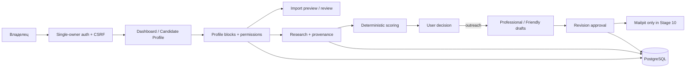

# Техническое задание: Outreach Opportunity System

**Статус документа:** актуальная рабочая версия для проектирования и разработки MVP  
**Версия:** 1.4 — personalization-first local pilot перед production decision  
**Дата:** 2 августа 2026  
**Предыдущая версия:** `AI_OUTREACH_SYSTEM_TZ_MVP_v1.3.md` сохраняется без изменений  
**Язык интерфейса MVP:** русский, с готовностью к локализации  
**Тип продукта:** персональная AI-система поиска и создания карьерных возможностей, mini-CRM и portfolio-проект по AI Automation  
**Основной пользователь:** один владелец системы  

**Рабочая папка проекта:**  
`C:\codex\Projects python\ai-outreach-system`

Codex работает только внутри указанной папки. Работа вне неё, публикация, deployment,
подключение внешних сервисов и необратимые действия требуют отдельного явного разрешения
владельца.

---

## 1. Назначение проекта

Outreach Opportunity System — персональная opportunity-first AI mini-CRM для управляемого
поиска и создания карьерных возможностей. Система анализирует публичные данные компаний,
сопоставляет их с согласованным профилем владельца, предлагает объяснимую оценку,
позиционирование и формат сотрудничества, а после решения владельца готовит черновики писем.

Вакансия является сильным opportunity signal, но не обязательным условием. Размер, зрелость,
известность компании, отсутствие найма, инвестиций или публичного роста сами по себе не
уменьшают релевантность.

До использования реального профиля обязателен отдельный этап персонализации и локального
пилота. Никакие извлечённые или предполагаемые сведения о владельце не считаются
подтверждёнными автоматически.

Система помогает владельцу:

1. согласовать профиль по отдельным смысловым блокам;
2. управлять разрешениями каждого факта или группы фактов;
3. безопасно импортировать структурированные данные через preview и review;
4. находить или вручную добавлять компании;
5. проводить research с provenance;
6. выявлять opportunity types и signals;
7. рассчитывать business, AI, hybrid, format, geography, timing и contactability fit;
8. рекомендовать positioning, роль, формат и decision-makers;
9. показывать причины писать, причины не писать и риски;
10. принимать только явное решение владельца по компании;
11. создавать Professional/Friendly drafts только после решения `outreach`;
12. отправлять тестовые письма в локальный Mailpit;
13. хранить историю, outcomes, follow-up и аналитику;
14. технически блокировать внешние действия до отдельного Production decision.

Проект не является системой массовой рассылки, автономным агентом, системой скрытого сбора
персональных данных или инструментом автоматического изменения профиля.

---

## 2. Главные принципы

### 2.1. Контроль пользователя

> AI анализирует и предлагает. Пользователь проверяет и принимает решение. Backend повторно
> проверяет статус, permissions и feature flags перед каждым чувствительным действием.

Без явного решения владельца запрещены:

- подтверждение реального факта или смыслового блока профиля;
- повышение уровня навыка, языка, seniority или ответственности;
- включение permissions;
- объединение спорных сведений;
- изменение подтверждённого профиля по результатам анализа компании;
- создание outreach draft до решения `outreach`;
- реальные отправки и follow-up;
- публикация, внешний экспорт и deployment;
- передача персональных данных внешним сервисам.

### 2.2. Privacy by default

Любые реальные персональные данные закрыты по умолчанию. Локальное хранение не означает
разрешение на AI analysis, scoring, draft, внешнюю отправку, подпись, экспорт или публикацию.
Каждая цель проверяется отдельно. Отзыв разрешения исключает данные из последующих операций
и аннулирует зависящие от них approvals.

### 2.3. Подтверждаемость

Факт, предположение и пользовательское решение хранятся раздельно. Существенная информация
имеет источник, дату, уровень доверия, статус проверки и, где применимо, точный фрагмент.
Для реального Candidate Profile дополнительно фиксируются смысловой блок, версия, actor и
явное решение владельца.

### 2.4. Безопасная автоматизация

Автоматизируются извлечение, поиск дублей и противоречий, validation, research, scoring,
recommendation, черновики и аналитика. Не автоматизируются подтверждение профиля,
разрешения, решение писать, отправка, публикация и изменение production.

### 2.5. Локальный пилот перед production

Этап 10 обязателен до VPS, домена, production SMTP и реальных отправок. Он выполняется только
на localhost с Docker Compose, FastAPI, PostgreSQL, Dashboard и Mailpit при:

```text
DEMO_MODE=True
ALLOW_REAL_EMAIL=False
ALLOW_PUBLICATION=False
ALLOW_EXTERNAL_EXPORT=False
```

---

## 3. Цели проекта

### 3.1. Практические цели

- создать безопасный ежедневный инструмент opportunity research;
- получить согласованный, версионируемый и честный профиль владельца;
- исключить автоматическое подтверждение реальных сведений;
- обрабатывать до 10 компаний за локальный тестовый цикл;
- находить возможности с вакансией и без неё;
- объяснимо выбирать Business-first, AI-first или Hybrid;
- сохранять provenance, decisions, drafts и outcomes;
- калибровать scoring и positioning на реальных публичных компаниях без внешней отправки;
- перейти к Production decision только после явного принятия результатов владельцем.

### 3.2. Учебные цели

FastAPI, PostgreSQL, SQLAlchemy, Alembic, Jinja2, HTMX, Bootstrap, REST API, Docker Compose,
AI adapters, authentication, CSRF, permission-aware data flows, CRM и тестирование.

### 3.3. Portfolio-цели

Публичные материалы могут содержать только synthetic data. Репозиторий должен показывать
архитектуру, approval gates, безопасный импорт, single-owner authentication, тесты,
миграции, Docker-запуск и synthetic screenshots без реальных PII.

---

## 4. Границы MVP

### 4.1. Входит в MVP

- single-owner authentication без регистрации;
- Candidate Profile с поэтапным согласованием 23 смысловых блоков;
- granular permissions и ConsentEvent;
- ручное заполнение;
- контролируемый preview-first импорт;
- компании, контакты, вакансии, кампании;
- sources, facts, signals, opportunities и assessments;
- Business-first, AI-first и Hybrid;
- decision gate;
- Professional/Friendly drafts;
- Review Center и revision-specific approval;
- Mailpit test send;
- feature-gated SMTP, остающийся заблокированным до отдельного решения;
- follow-up proposal без автоматической отправки;
- communication history, suppression, audit и analytics;
- локальный пилот, калибровка и расширенный цикл до 10 компаний.

### 4.2. После MVP или после отдельного Production decision

- VPS, DNS, reverse proxy и HTTPS;
- production SMTP или Gmail/Outlook OAuth;
- Redis/Celery, React, OpenTelemetry;
- внешняя CRM;
- несколько пользователей и публичный Dashboard;
- автоматическая синхронизация почты;
- VPN, IP allowlist или 2FA;
- внешний secret manager и object storage.

### 4.3. Не входит

- массовая или автоматическая рассылка;
- автоматическое подтверждение профиля;
- автоматическое изменение профиля по company research;
- автоматическое включение permissions;
- автоматическое объединение конфликтующих импортированных данных;
- реальные отправки в Этапе 10;
- tunnel, port forwarding или публикация localhost;
- скрытый сбор данных, обход CAPTCHA/paywall/robots.txt;
- выдуманный опыт, достижения или уровень навыка;
- реальные PII в repo, logs, demo или screenshots.

---

## 5. Архитектура MVP

### 5.1. Стиль

Модульный монолит: одно FastAPI-приложение, PostgreSQL как источник истины, server-rendered UI,
адаптеры внешних интеграций и транзакционные server-side guards.

### 5.2. Стек

- Python 3.12+, FastAPI, Pydantic Settings;
- SQLAlchemy 2.x, Alembic, PostgreSQL;
- Jinja2, HTMX, Bootstrap 5;
- HTTPX Safe Fetcher;
- Docker Compose и Mailpit;
- provider abstractions для AI, discovery и email;
- Argon2id-совместимая библиотека password hashing;
- серверные owner sessions и CSRF tokens.

### 5.3. Логическая схема



---

## 6. Модули приложения

```text
auth
candidate_profile
profile_review
profile_import
companies
contacts
jobs
campaigns
opportunities
sources
research
relevance
strategy
generation
review
delivery
followups
communications
analytics
settings
audit
shared
```

`profile_review` управляет блоками, решениями и версиями. `profile_import` создаёт
preview, validation и review items без автоматической активации. `auth` защищает UI и
cookie-auth API. Остальные модули сохраняют назначение v1.3.

---

## 7. Структура репозитория

Сохраняется структура v1.3. Добавляются при реализации:

```text
app/modules/auth/
app/modules/profile_review/
app/modules/profile_import/
app/templates/auth/
app/templates/candidate_profile/review/
tests/security/
tests/e2e/
docs/pilot/
```

Реальные импортируемые документы, дампы, credentials и pilot data не коммитятся.

---

## 8. Хранение данных

### 8.1. Основное решение

PostgreSQL — единственный источник истины. Реальные данные хранятся локально. Внешний экспорт
выключен и требует отдельного consent и feature flag.

### 8.2. Сущности v1.3

Сохраняются `CandidateProfile`, `CandidateExperience`, `CandidateSkill`,
`CandidateStrength`, `CandidateFact`, `CandidateContact`, `CandidateRule`,
`Company`, `CompanySource`, `CompanyFact`, `OpportunitySignal`,
`CompanyOpportunity`, `OpportunityAssessment`, `PositioningRecommendation`,
`JobOpening`, `Contact`, `Campaign`, drafts, approvals, messages, follow-ups,
communications, suppression, consent и audit.

Opportunity, scoring, pipeline и delivery semantics v1.3 сохраняются.

### 8.3. Новые и расширенные сущности

#### User

- id;
- login_identifier;
- password_hash;
- status;
- timezone;
- password_changed_at;
- last_login_at;
- created_at;
- updated_at.

Пароль и его plaintext никогда не хранятся и не логируются. Публичной регистрации нет.

#### AuthSession

- id;
- user_id;
- token_hash;
- csrf_secret_hash или связанный CSRF state;
- created_at;
- last_seen_at;
- expires_at;
- revoked_at;
- safe client metadata.

#### LoginAttempt

- id;
- normalized login identifier или безопасный hash;
- result;
- safe reason code;
- occurred_at;
- request_id;
- IP/user-agent только в минимально необходимом и безопасном виде.

#### CandidateProfileSection

- id;
- profile_id;
- section_type;
- status: `DRAFT/REVIEW_REQUIRED/USER_APPROVED/VERIFIED`;
- content_hash;
- version;
- user_comment;
- approved_at;
- verified_at;
- approved_by;
- created_at;
- updated_at.

Состояния:

```text
DRAFT → REVIEW_REQUIRED → USER_APPROVED → VERIFIED
```

`USER_APPROVED` и `VERIFIED` требуют отдельного явного owner action. Изменение содержимого
возвращает только затронутый блок в `REVIEW_REQUIRED` и сохраняет историю.

#### ProfileReviewEvent

- profile_section_id;
- from_status;
- to_status;
- decision: approve/correct/defer/reject/verify;
- actor;
- comment;
- safe_diff;
- occurred_at;
- request_id.

#### ProfileImportBatch

- id;
- source_filename;
- source_format;
- source_hash;
- status: uploaded/preview_ready/validation_failed/review_required/partially_applied/applied/rejected;
- validation_report;
- created_at;
- reviewed_at;
- applied_at.

Оригинал файла хранится только локально по необходимости и согласно retention policy.

#### ProfileImportItem

- batch_id;
- section_type;
- operation: proposed_create/proposed_update/match/conflict/skipped;
- target_entity_type;
- target_entity_id;
- proposed_data;
- current_data_snapshot;
- validation_messages;
- default_permissions;
- decision: pending/approved/corrected/deferred/rejected;
- applied_entity_id;
- version.

Применение выполняется транзакционно только для явно подтверждённых items или групп.

### 8.4. Обязательные смысловые блоки профиля

1. Основное позиционирование.
2. Профессиональный заголовок и summary.
3. Управленческий и бизнес-опыт.
4. Должности, периоды и отрасли.
5. Проекты и подтверждённые достижения.
6. Размеры команд, бюджеты и ответственность.
7. География опыта.
8. Подрядчики, партнёры и переговоры.
9. AI-проекты.
10. Технические навыки и реальный уровень каждого навыка.
11. Сильные стороны.
12. Желаемые и смежные роли.
13. Запрещённые и нежелательные роли.
14. Full-time, part-time и project work.
15. Consulting и contract.
16. Remote, hybrid и on-site.
17. Relocation и командировки.
18. Страны и регионы.
19. Доход и карьерные ограничения.
20. Английский и другие языки.
21. Контакты.
22. Ограничения позиционирования.
23. Permissions и consent.

### 8.5. Permission matrix

Для факта или группы фактов отдельно:

- `store_private`;
- `use_for_ai_analysis`;
- `use_in_scoring`;
- `use_in_draft`;
- `send_externally`;
- `use_in_signature`;
- `publish_publicly`.

Все внешние и downstream permissions выключены по умолчанию. `store_private` не включает
другие permissions. Scoring использует только `USER_APPROVED` или `VERIFIED` данные с
`use_in_scoring=true`. Draft и send требуют более строгих соответствующих разрешений.

### 8.6. Ключевые ограничения

- никакой import item не получает `VERIFIED` автоматически;
- импорт не перезаписывает и не удаляет записи без решения владельца;
- спорные данные не объединяются автоматически;
- профиль не имеет global approve action;
- AI и company research не меняют Candidate Profile;
- отзыв permission применяется к следующим AI/scoring/draft/send/publication операциям;
- approval draft аннулируется при изменении использованного profile data или consent;
- все ограничения v1.3 по idempotency, suppression, provenance и synthetic demo сохраняются.

---

## 9. Состояния

### 9.1. Profile section lifecycle

```text
DRAFT
→ REVIEW_REQUIRED
→ USER_APPROVED
→ VERIFIED
```

Доступные owner actions на каждом блоке: подтвердить, исправить, отложить, отклонить.
Исправление создаёт новую версию. Одной кнопки подтверждения всего профиля нет.

### 9.2. Import lifecycle

```text
UPLOADED
→ PREVIEW_READY
→ VALIDATION_FAILED | REVIEW_REQUIRED
→ PARTIALLY_APPLIED | APPLIED | REJECTED
```

### 9.3. Company, draft и follow-up lifecycle

Сохраняются состояния v1.3. Только owner decision `outreach` переводит компанию в
`APPROVED_FOR_OUTREACH`. Обычный PATCH pipeline status не обходит decision gate.

---

## 10. Dashboard и mini-CRM

Dashboard сохраняет opportunity KPI v1.3 и добавляет:

- readiness каждого profile block;
- количество блоков `REVIEW_REQUIRED`;
- conflicts и pending import items;
- permissions warnings;
- authentication/session status;
- pilot progress: 3–5 компаний, calibration, extended cycle;
- Mailpit-only indicator;
- видимые значения внешних feature flags;
- блокеры перехода к Этапу 11.

Candidate Profile показывает 23 независимых блока и действия подтвердить, исправить,
отложить, отклонить. Companies, Pipeline, Review Center и Analytics сохраняют функции v1.3.

---

## 11. Candidate Profile и личные данные

### 11.1. Правило готовности

Реальный профиль никогда не считается автоматически готовым или `VERIFIED`. Codex и AI
могут создать структуру, безопасный draft, извлечь предполагаемые факты, найти дубли и
противоречия, предложить формулировки и показать preview.

Только владелец может:

- перевести блок в `USER_APPROVED`;
- подтвердить `VERIFIED`;
- определить actual skill/language level;
- включить permissions;
- объединить спорные сведения;
- разрешить AI, scoring, draft, signature, send или publication.

### 11.2. Ручное заполнение

Редактирование выполняется через Dashboard. Сохранение создаёт `DRAFT` или
`REVIEW_REQUIRED`, но не `VERIFIED`. Изменения не должны терять другие разделы,
permissions или историю.

### 11.3. Контролируемый импорт

```text
Import → Preview → Validation → Review Required → owner confirmation → Save
```

До применения показываются:

- proposed creates и updates;
- совпадения и дубли;
- конфликты;
- пропущенные и invalid значения;
- current/proposed diff;
- permissions, остающиеся выключенными.

Импорт поддерживает подтверждение по каждой группе. Неподтверждённые items не применяются.

### 11.4. Fact pack

Fact pack строится по purpose и включает только записи, одновременно удовлетворяющие:

- подходящему status;
- актуальной версии;
- нужному permission;
- отсутствию отзыва consent;
- применимому positioning constraint.

Preview показывает включённые и исключённые IDs с причинами.

### 11.5. Калибровка профиля

Пробелы, обнаруженные в pilot, создают предложения в `DRAFT/REVIEW_REQUIRED`. Система не
изменяет `USER_APPROVED/VERIFIED` blocks автоматически.

---

## 12. Discovery и Research

Сохраняются Safe Fetcher, SSRF protection, robots.txt, rate limits, timeout, content limit,
provenance, факты, signals, hypotheses и контакты v1.3.

На Этапе 10 разрешён анализ публичных сайтов 3–5, затем до 10 реальных компаний. Сайт не
получает персональные данные владельца. Передача профиля AI допускается только в отдельно
согласованном объёме и только из разрешённого fact pack.

---

## 13. Relevance scoring

Сохраняются восемь объяснимых компонентов и формула v1.3:

- business fit;
- AI automation fit;
- hybrid fit;
- format fit;
- geography fit;
- timing signal;
- contactability;
- overall opportunity score.

Каждая компонента использует только разрешённые для scoring и согласованные profile data.
Размер и maturity не являются penalty. Отсутствие vacancy не блокирует
`GENERAL_COMPETENCE_FIT`. После pilot калибровка меняет versioned rules/weights, но не
переписывает профиль.

---

## 14. Определение языка

Приоритет v1.3 сохраняется. Уровень языка владельца берётся только из явно согласованного
блока профиля. AI не повышает его и не выводит уровень из текста, страны или документов без
owner approval.

---

## 15. Communication strategy и генерация

Business-first, AI-first и Hybrid сохраняются. Strategy использует только согласованный
profile snapshot. Результат содержит possible role, collaboration format, decision-makers,
reasons to contact/not contact, risks и concrete offer.

Draft создаётся только после recorded owner decision `outreach`. Validator повторно
проверяет status блоков, permissions, consent, evidence, contact, decision gate, language,
seniority и positioning constraints.

На Этапе 10 drafts разрешены, но доставка возможна только в Mailpit.

---

## 16. Approval, отправка и публикация

Approval привязан к ревизии и profile snapshot, одноразовый и аннулируется после изменений.

В Этапе 10 backend обязан отказать в реальной отправке независимо от UI:

```text
DEMO_MODE=True
ALLOW_REAL_EMAIL=False
ALLOW_PUBLICATION=False
ALLOW_EXTERNAL_EXPORT=False
```

Mailpit test send сохраняет audit и idempotency. Публикация, внешний экспорт, production SMTP,
VPS и домен не выполняются.

---

## 17. Follow-up

Follow-up создаётся только после успешной отправки, требует approval и никогда не отправляется
автоматически. В локальном pilot он проверяется только через Mailpit. Ответ или outcome
отменяет открытые follow-ups.

---

## 18. Communication History

Timeline v1.3 расширяется:

- profile section review;
- import preview/validation/apply;
- permission grant/revoke;
- login success/failure/logout/session expiration;
- pilot company inclusion;
- calibration issue и решение;
- pilot gate result.

Реальные profile values и credentials не включаются в технические логи.

---

## 19. API

Сохраняются endpoints v1.3 и добавляются:

```text
POST /api/v1/auth/login
POST /api/v1/auth/logout
GET  /api/v1/auth/session

GET  /api/v1/candidate-profile/sections
GET  /api/v1/candidate-profile/sections/{section}
PATCH /api/v1/candidate-profile/sections/{section}
POST /api/v1/candidate-profile/sections/{section}/review

POST /api/v1/candidate-profile/imports
GET  /api/v1/candidate-profile/imports/{id}/preview
POST /api/v1/candidate-profile/imports/{id}/validate
POST /api/v1/candidate-profile/imports/{id}/items/{item_id}/decision
POST /api/v1/candidate-profile/imports/{id}/apply

GET  /api/v1/pilot/readiness
POST /api/v1/pilot/calibration-notes
```

Cookie-auth mutations требуют valid session и CSRF. API не позволяет напрямую установить
`USER_APPROVED/VERIFIED` через обычный CRUD update: используется отдельный review action.

---

## 20. Безопасность

### 20.1. Single-owner authentication

До загрузки реальных данных обязательны:

- login page;
- один владелец, без публичной регистрации;
- Argon2id password hash;
- HTTP-only session cookie;
- SameSite=Lax или более строгое значение;
- session expiration, rotation и logout;
- CSRF для всех HTML mutation forms;
- ограничение попыток входа;
- audit успешных и неуспешных попыток;
- закрытие Dashboard, Candidate Profile, companies, contacts, drafts, communications,
  settings и audit для anonymous users.

В локальном HTTP режиме Secure-cookie настраивается по environment. Production требует
HTTPS и `Secure=true`; запуск production без них завершается fail-closed.

### 20.2. Application и AI security

Сохраняются SSRF protection, input validation, parameterized ORM, security headers, limits,
secret masking, prompt-injection isolation и structured output. AI не имеет инструментов
отправки, не меняет permissions/status profile blocks и не принимает owner decisions.

### 20.3. Персональные данные

- data minimization и purpose limitation;
- локальное хранение на Этапе 10;
- no real PII in repo/logs/screenshots;
- no external processing без scoped consent;
- безопасный preview импорта;
- retention и удаление определяются до production;
- отозванные permissions применяются немедленно к будущим операциям.

### 20.4. Секреты и локальный контур

Login/password, session secret, API keys и SMTP credentials находятся только в локальном
environment/secret storage, не в repo, source, seed или logs.

Без отдельного разрешения запрещены VPS, domain setup, tunnel, port forwarding, git push,
production SMTP, real email, external export, publication и платные API сверх лимита.

### 20.5. Production perimeter

Только при положительном Этапе 11 допускается проектирование:

- `outreach.<domain>`;
- VPS;
- DNS;
- Nginx/Traefik;
- HTTPS/TLS и автоматическое обновление сертификата;
- закрытый PostgreSQL;
- отсутствие прямого публичного FastAPI port;
- secure cookies, CSRF, rate limiting и security headers;
- backups, monitoring, VPN/IP allowlist/2FA по отдельному решению.

Наличие домена не является разрешением на deployment или обработку реальных данных.

---

## 21. Логи и наблюдаемость

Activity log, application log и audit log сохраняются. Audit обязательно включает login,
logout, session expiration, profile review, import decisions, permissions, outreach decision,
approval, test send, попытки blocked real send/export/publication и calibration changes.

Не логируются пароли, session/CSRF tokens, profile values целиком, письмо целиком, реальные
контакты без маскирования или оригинальные импортируемые документы.

---

## 22. Правила работы Codex

### 22.1. Разрешённая автономность

Внутри утверждённого этапа и рабочей папки Codex может менять код, миграции, тесты и docs,
запускать Docker Compose и использовать synthetic data.

### 22.2. Явное разрешение владельца

Требуется для git push/PR, deployment, VPS, DNS, tunnel, публикации, production SMTP, реальных
отправок, внешнего экспорта, передачи реальных PII, платных API, удаления реальных данных,
изменения production и файлов вне проекта.

### 22.3. Политика остановки

Не более двух осмысленных попыток одной операции. После второй неудачи сохранить рабочее
состояние, остановить подзадачу и сообщить ошибку, изменённые файлы и безопасный следующий шаг.

### 22.4. Защита файлов и версий ТЗ

- v1.3 не удаляется и не перезаписывается;
- реальные pilot/import files не коммитятся;
- backup выполняется перед рискованной миграцией;
- destructive database actions на реальных данных запрещены без разрешения;
- секреты не коммитятся.

---

## 23. Тестирование

### 23.1. Уровни

Unit, PostgreSQL integration, API, Jinja/HTMX, security, migration, Docker smoke и e2e.

### 23.2. Критичные новые сценарии

- anonymous user перенаправляется на login и не видит PII;
- неверный login ограничивается и фиксируется без утечки password;
- session expires и logout revokes session;
- mutation без CSRF блокируется;
- production config без Secure cookie/HTTPS fail-closed;
- новый profile block не получает `USER_APPROVED/VERIFIED`;
- обычный CRUD не обходит review transition;
- нет global approve всего профиля;
- исправление одного блока не сбрасывает и не изменяет другие;
- import сначала создаёт preview и ничего не применяет;
- invalid/conflict/skipped items видимы;
- импорт не удаляет и не перезаписывает данные автоматически;
- imported permissions остаются false;
- AI/scoring/draft исключают неразрешённые или отозванные факты;
- company research не меняет Candidate Profile;
- draft до `outreach` блокируется;
- real SMTP, publication и export заблокированы в local pilot;
- test sends приходят только в Mailpit;
- 3–5 company pilot и extended cycle до 10 не создают дублей;
- calibration сохраняет versioned changes и требует profile re-review;
- все критичные сценарии v1.3 сохраняются.

### 23.3. Quality gates

Ruff, MyPy, full pytest, migration check, Docker build/smoke, dependency/secret scan,
authentication/security tests, no real PII scan и проверка отсутствия обхода
profile/decision/approval/consent gates.

---

## 24. Docker Compose

Локальный Этап 10 использует:

```text
app
postgres
mailpit
```

Dashboard доступен только на localhost. Нельзя добавлять tunnel или port forwarding.
PostgreSQL volume и backup остаются локальными. Demo seed содержит только synthetic data.
Real SMTP не подключается.

---

## 25. Этапы разработки

### Этапы 0–9

Baseline, Candidate Profile foundation, Mini-CRM Core, Research, Relevance, Generation,
Review Center, Delivery guards, Follow-up/History и Analytics/Portfolio сохраняют scope v1.3.
Завершённый код не перерабатывается без необходимости, но проходит regression после Этапа 10.

### Этап 10. Personalization and Local Pilot

Этап обязателен до Production decision.

#### 10.1. Только локальный режим

Docker Compose, FastAPI, PostgreSQL, Dashboard и Mailpit; четыре внешних feature flags остаются
false/безопасными. Никаких VPS, домена, tunnel, push, production SMTP или реальных отправок.

#### 10.2. Single-owner authentication

Реализовать User/AuthSession/LoginAttempt, login/logout, password hash, cookie security, CSRF,
expiration, rate limiting, audit и защиту всех private routes.

#### 10.3. Согласование профиля

Реализовать 23 отдельных section states и owner actions. Мигрировать существующие реальные
записи в `DRAFT` или `REVIEW_REQUIRED`, никогда автоматически в `VERIFIED`.

#### 10.4. Granular permissions

Добавить `use_in_scoring` и `use_in_signature`, fail-closed defaults, purpose-specific
fact packs, revoke semantics и audit.

#### 10.5. Безопасный импорт

JSON/structured import через upload, preview, validation, per-group review и apply. Никаких
автоматических overwrite/delete/merge/verified/permissions.

#### 10.6. Первая волна pilot

После согласования минимально достаточного профиля обработать локально 3–5 реальных публичных
компаний:

- минимум одна с вакансией;
- минимум одна без вакансии;
- минимум одна Business-first;
- минимум одна AI-first или Hybrid;
- по возможности remote, project и relocation.

Для каждой проверить research, provenance, opportunities, signals, все scoring components,
positioning, role, collaboration format, два decision-makers, reasons, risks и оба drafts.
Draft создаётся только после `outreach`; test send идёт только в Mailpit.

#### 10.7. Калибровка

Совместно разобрать завышенный/заниженный score, нехватку profile data, positioning, форматы,
management/AI balance, sources, contacts и естественность писем. Изменения профиля проходят
повторное согласование. Правила и веса версионируются.

#### 10.8. Расширенный pilot

После исправлений обработать до 10 компаний за один локальный цикл: real public companies,
local storage, manual decisions, draft after outreach, Mailpit only, no VPS/publication/SMTP.

#### 10.9. Критерии завершения Этапа 10

- обязательные profile blocks согласованы владельцем;
- ни один real fact не подтверждён автоматически;
- permissions проверены;
- сохранение/редактирование не теряет данные;
- authentication и CSRF работают;
- anonymous user не видит Dashboard или PII;
- pilot 3–5 компаний и calibration проведены;
- цикл до 10 компаний проверен;
- decision gate не обходится;
- real email/publication/export заблокированы;
- все test sends находятся в Mailpit;
- scoring и positioning признаны владельцем приемлемыми;
- ограничения и ошибки документированы;
- regression и Docker smoke пройдены.

Владелец отдельно подтверждает завершение Этапа 10. Технический успех тестов не заменяет это
решение.

### Этап 11. Production decision

Только после принятого Этапа 10 отдельно решить:

- нужен ли VPS и какой hosting;
- домен/поддомен, DNS, TLS и reverse proxy;
- backups, restore test и retention;
- jurisdiction и legal review;
- secret manager;
- production SMTP или Gmail/Outlook OAuth;
- monitoring;
- разрешение на реальные данные и отправки;
- частоту запуска;
- VPN, IP allowlist или 2FA;
- способ защищённого доступа.

Переход к Этапу 11 не разрешает deployment, публикацию или отправку автоматически.

---

## 26. Definition of Done

Функция готова, если backend/UI/validation/migration/tests/docs реализованы, audit добавлен
для чувствительных действий, Docker запускается, PII и secrets не раскрываются.

MVP v1.4 готов к Production decision только если дополнительно:

- Этапы 0–9 сохраняют regression;
- real profile согласован по обязательным блокам;
- status transitions требуют owner action;
- import preview-first и fail-closed;
- granular permissions работают по purpose;
- authentication, session, CSRF, rate limit и route protection проверены;
- local pilot 3–5, calibration и extended cycle до 10 завершены;
- scoring/positioning приняты владельцем;
- draft невозможен до `outreach`;
- real email/publication/export остаются технически заблокированными;
- Mailpit является единственным delivery target;
- владелец явно принял результат Этапа 10.

---

## 27. Acceptance-сценарий MVP

1. Владелец запускает Docker Compose локально.
2. Anonymous user не получает доступ к private routes.
3. Владелец входит; login audit и secure local session созданы.
4. Владелец открывает Candidate Profile с 23 независимыми блоками.
5. Создаёт или импортирует структурированный черновик.
6. Import preview показывает creates, updates, matches, conflicts, skipped и permissions=false.
7. До подтверждения import не меняет profile tables.
8. Владелец отдельно исправляет/откладывает/отклоняет/подтверждает группы.
9. Ни один факт не становится `VERIFIED` автоматически.
10. Владелец отдельно включает необходимые AI/scoring/draft permissions.
11. Fact-pack preview показывает included/excluded data и причины.
12. Владелец добавляет 3–5 реальных публичных компаний, включая vacancy/non-vacancy и разные positioning cases.
13. Research сохраняет sources/provenance и не изменяет Candidate Profile.
14. Assessment показывает восемь score-компонентов и breakdown.
15. Recommendation показывает positioning, role, format, decision-makers, reasons и risks.
16. До решения `outreach` draft endpoint возвращает block.
17. После `outreach` создаются Professional/Friendly только из разрешённых facts.
18. Validator блокирует неподтверждённый claim и завышенный AI/language level.
19. Владелец редактирует и approve конкретную revision.
20. Send test доставляет ровно одно письмо в Mailpit.
21. Real send, publication и export возвращают fail-closed error.
22. Проводится calibration, changes получают новые версии и profile re-review.
23. Обрабатывается расширенный цикл до 10 компаний.
24. Analytics показывает pilot funnel и outcomes без оптимизации на объём отправок.
25. Logout закрывает session; повторный доступ требует login.
26. Regression, security и Docker smoke tests проходят.
27. Владелец отдельно принимает или не принимает Этап 10.
28. Только после принятия открывается обсуждение Этапа 11.

---

## 28. Метрики и аналитика MVP

Сохраняются opportunity metrics v1.3:

- companies added/analyzed/processed;
- vacancy/non-vacancy opportunities;
- Business-first/AI-first/Hybrid;
- formats, decisions, watchlist;
- verified contacts;
- drafts/review/approval;
- Mailpit/real/failed delivery;
- replies, interviews, project/consulting discussions, offers/agreements;
- follow-up due и stage duration.

Добавляются personalization/pilot metrics:

- profile blocks по каждому status;
- percentage обязательных blocks в `USER_APPROVED/VERIFIED`;
- pending corrections/deferred/rejected blocks;
- permissions enabled по purpose без отображения PII;
- import creates/updates/matches/conflicts/skipped;
- import items pending/approved/rejected;
- login success/failure/rate-limited/session-expired;
- pilot companies planned/processed;
- vacancy/non-vacancy coverage;
- positioning и format coverage;
- scoring calibration deltas по version;
- blocked claims и причины;
- Mailpit test deliveries;
- blocked real-send/publication/export attempts.

Метрики не должны содержать sensitive profile values и не оптимизируются под максимальное
количество писем.

---

## 29. Отложенные технологии

React, Redis/Celery, OpenTelemetry, Bitrix24, Gmail/Outlook OAuth, multi-user, VPS и production
security perimeter остаются отложенными до доказанной необходимости и отдельного решения
владельца.

---

## 30. Итоговое решение и порядок запуска

Актуальная последовательность:

```text
Этапы 0–8 — core opportunity workflow
Этап 9 — Analytics и Portfolio
Этап 10 — Personalization and Local Pilot
Этап 11 — Production decision
```

Итоговый порядок:

1. сохранить завершённые этапы и safe defaults;
2. локально реализовать authentication, profile review и safe import;
3. согласовать минимально достаточный реальный профиль по блокам;
4. проверить permissions и purpose-specific fact packs;
5. провести local pilot 3–5 компаний только с Mailpit;
6. провести calibration и повторное согласование изменений;
7. выполнить extended local cycle до 10 компаний;
8. пройти regression/security/Docker gates;
9. получить явное решение владельца о завершении Этапа 10;
10. только затем обсуждать Production decision;
11. deployment, домен, SMTP, real data, real sends и публикация требуют отдельных разрешений.

Ключевое правило:

> Система не подтверждает реальный профиль автоматически и не переходит от локального pilot к
> production по техническому факту завершения разработки. Каждое подтверждение данных и
> каждое внешнее действие остаётся отдельным явным решением владельца.
